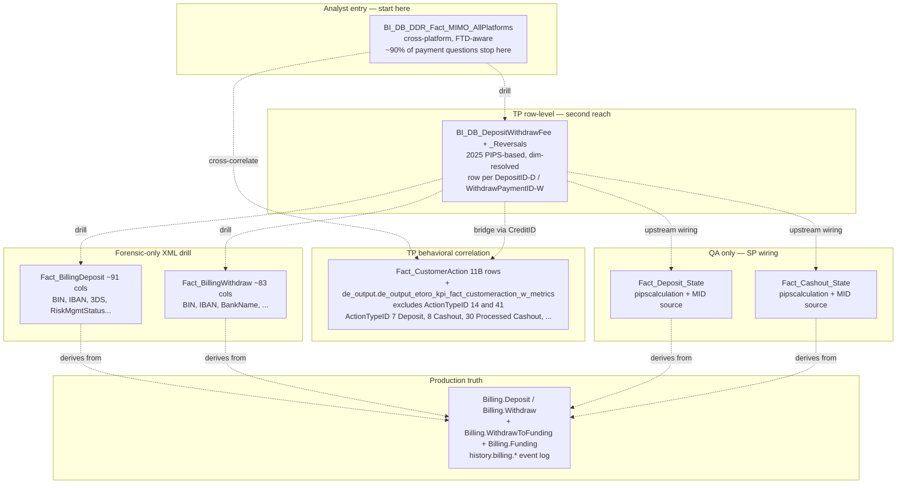

# C.1 — Deposits & Withdrawals (Trading Platform)

This skill is a **ranking + routing** layer for TP fiat payment questions, not a mini-wiki. The skill tells you WHICH table to reach for first; the column-level detail lives in the wikis (cloned to UC) and in UC column descriptions.

> **Genie / SQL note:** SQL examples below use UC FQNs. Synapse names that
> still appear in body prose / mermaid are aliases — see `primary_objects:`
> for the canonical UC FQN. Four upstream State tables are listed in
> `synapse_only_objects:` (Fact_Deposit_State, Fact_Cashout_State,
> Fact_Cashout_Rollback, Dim_BillingProtocolMIDSettingsID) — they are
> queryable in Synapse only. The QA section below explicitly says when to
> drop down to them.

## The reach order (start at #1, descend only when needed)

| # | Reach for | Why | When to stop here |
|---|---|---|---|
| **0** | `BI_DB_DDR_Fact_MIMO_AllPlatforms` *(C.2)* | Cross-platform unified, dim-resolved, FTD machinery applied. Carries `OrigIdentifier`/`TransactionID` (= the source-platform row ID, including `WithdrawPaymentID` for TP withdrawals). | Question is about volumes, FTDs, deposit/withdraw counts at any aggregate. **~90% of TP payment questions stop here.** |
| **1** | **`BI_DB_DepositWithdrawFee` + `BI_DB_DepositWithdrawFee_Reversals`** | The canonical analyst-facing TP row-level view. **Replaces legacy deposit/withdraw logic with the RnD PIPS-based 2025 pipeline.** UNION ALL of deposits + withdrawals, already dim-resolved (`PaymentMethod`, `MIDName`, `Depot`, `RegCountry`, `BinCountry`, `Club`, `PlayerStatus`, `CardType`, `Regulation`), already sign-corrected, with `PIPsCalculation` (production conversion fee) baked in. | Question needs row-level TP detail with dim attributes — fee composition, MID-level breakdown, single-customer deposit forensics, refund/chargeback aggregation. **The default TP row table.** |
| **2** | **`Fact_CustomerAction` / `de_output.de_output_etoro_kpi_fact_customeraction_w_metrics`** | The 11B-row TP behavioral master — every position open/close + deposit + cashout + login + bonus + fee tied together. The `_w_metrics` table enriches FCA with the most relevant DDR metrics (TP revenues, special comp types, classifiers like CopyFunds / SQF / TradeFromIBAN, …) at the most granular transaction level. **Excludes ActionTypeID 14 + 41** (large + irrelevant) and prunes some columns. Bridges deposits ↔ trades ↔ logins. | Question correlates a deposit/withdrawal with what the customer DID before/after — first trade after FTD, deposit-to-trade lag, fee event tied to a specific position close, bonus events. |
| **3** | `Fact_BillingDeposit` / `Fact_BillingWithdraw` | Row-level Synapse facts with all 80+ XML-extracted columns (BIN, IBAN, SWIFT, BankName, 3DS response, RiskManagementStatusID, ThreeDsResponseType, declines). Less convenient (not dim-resolved). | Only when you need a column NOT in `BI_DB_DepositWithdrawFee` — typically: 3DS forensics, BIN/IBAN string detail, RiskManagementStatusID drill, declined-attempt analysis (decline rows are dropped from the BI layer). |
| **QA** | `Fact_Deposit_State` / `Fact_Cashout_State` / `Fact_Cashout_Rollback` | Upstream wiring of the `BI_DB_DepositWithdrawFee` SP. Carries `pipscalculation` and MID at row level — the SP joins them in. | **Don't reach here for analyst questions.** Use only for QA — e.g. "row in DepositWithdrawFee looks wrong, where did the SP go astray". |
| **Recon** | `Billing.Deposit` / `Billing.Withdraw` / `Billing.WithdrawToFunding` / `Billing.Funding` *(production OLTP)*, `history.billing.*` *(UC bronze, full state-event log)* | Truth source. Production tables that DWH derives everything from. | Only for production reconciliation, audit, or when you doubt the DWH/BI layer. The full historical event log is in `history.billing.*`. |

**The cardinal rule**: do not "go upstream" for an answer the analyst-facing tables already give you. If MIMO has it, stop at MIMO. If `BI_DB_DepositWithdrawFee` has it, stop there. The State tables and raw billing exist because the BI layer is BUILT from them, not because analysts query them.

## Mental model (right-side-up pyramid)



## Worked example — the `WithdrawPaymentID` lineage

Where does this column live, what does it mean, how do I use it.

| Tier | Table | Column | Notes |
|------|-------|--------|-------|
| **Production** | `Billing.WithdrawToFunding` | `ID` | Surrogate primary key of the withdraw execution leg. One customer withdrawal request → 1 `Billing.Withdraw` row → **N `Billing.WithdrawToFunding` rows** (one per execution leg) → 1 `Billing.Funding` per leg. |
| **DWH analytical** | `Fact_BillingWithdraw` | `WithdrawPaymentID` | Renamed from prod `ID` to disambiguate from `WithdrawID` / `FundingID`. **`WithdrawPaymentID` is unique per row in `Fact_BillingWithdraw` — no dedupe needed.** Distribution is `HASH(WithdrawID)` so multiple legs of the same Withdraw co-locate, but the leg ID itself is the unique row key. (One Withdraw → N WithdrawToFunding legs; each leg = one unique `WithdrawPaymentID`.) |
| **BI analyst-facing** | `BI_DB_DepositWithdrawFee` | `WithdrawPaymentID` (col 43) — populated only on withdraw rows; NULL on deposit rows. Deposit-side equivalent is `DepositID` (col 42). | The SP already deduped Fact_BillingWithdraw before the join, so analysts don't see the multi-row issue here. |
| **Top aggregate (cross-platform)** | `BI_DB_DDR_Fact_MIMO_AllPlatforms` | `OrigIdentifier = 'WithdrawPaymentID'` (col 5) + `TransactionID = <the value>` (col 6) | MIMO carries it, just labelled. Use `WHERE OrigIdentifier = 'WithdrawPaymentID' AND TransactionID = @wpid` to find a TP withdrawal in the cross-platform view. |
| **Behavioral correlate** | `Fact_CustomerAction` | (Not directly — bridges via `CreditID`) | `BI_DB_DepositWithdrawFee.CreditID` (col 44) ties a withdrawal to its `Fact_CustomerAction` row. ActionTypeID 8 (Cashout) / 30 (Processed Cashout) are the TP withdraw events. |

## Canonical joins (using the right table)

> SQL below uses **Unity Catalog FQNs** so Databricks Genie can run them as-is.
> The QA-only example for `Fact_Deposit_State` is shown in **Synapse** form
> because the table is `_Not_Migrated` and only queryable there.

```sql
-- Withdrawal volume by Regulation × MID — analyst-facing, no JOINs needed for dim resolution (UC)
SELECT Regulation, MIDName, MIDValue, Depot,
       SUM(AmountUSD) AS volume_usd, COUNT(*) AS n
FROM main.bi_db.gold_sql_dp_prod_we_bi_db_dbo_bi_db_depositwithdrawfee
WHERE TransactionType = 'Withdraw'
  AND DateID BETWEEN :from_dt AND :to_dt
GROUP BY Regulation, MIDName, MIDValue, Depot
```

```sql
-- Single-customer deposit forensics — one table for ~95% of attributes (UC)
SELECT DateID, Occurred, TransactionType, PaymentMethod, Currency,
       Amount, AmountUSD, PIPsCalculation, MIDName, Depot, RegCountry,
       BinCountry, CardType, CardCategory, ExternalTransactionID,
       TransactionStatus, PreviousTransactionStatus, DepositID, WithdrawPaymentID
FROM main.bi_db.gold_sql_dp_prod_we_bi_db_dbo_bi_db_depositwithdrawfee
WHERE CID    = :cid
  AND DateID BETWEEN :from_dt AND :to_dt
ORDER BY Occurred
```

```sql
-- Customer behavior correlation: deposit → first trade lag (UC; uses FCA, not billing)
WITH first_dep AS (
  SELECT RealCID, MIN(ActionDate) AS first_dep_at
  FROM main.dwh.gold_sql_dp_prod_we_dwh_dbo_fact_customeraction
  WHERE ActionTypeID IN (7, 38, 44)              -- Deposit / Affiliate / Internal
  GROUP BY RealCID
), first_trade AS (
  SELECT RealCID, MIN(ActionDate) AS first_open_at
  FROM main.dwh.gold_sql_dp_prod_we_dwh_dbo_fact_customeraction
  WHERE ActionTypeID IN (1, 2, 3, 39)            -- position opens
  GROUP BY RealCID
)
SELECT fd.RealCID,
       (UNIX_TIMESTAMP(ft.first_open_at) - UNIX_TIMESTAMP(fd.first_dep_at)) / 60.0
         AS minutes_dep_to_trade
FROM first_dep fd
JOIN first_trade ft USING (RealCID)
```

```sql
-- ONLY when you need an XML-extracted column not in DepositWithdrawFee — UC
-- e.g. 3DS response type or RiskManagementStatusID drill
SELECT *
FROM main.dwh.gold_sql_dp_prod_we_dwh_dbo_fact_billingdeposit fbd
WHERE fbd.ModificationDateID BETWEEN :from_dt AND :to_dt
  AND fbd.PaymentStatusID = 35                    -- DeclineByRRE
  AND TRY_CAST(fbd.ThreeDsResponseType AS INT) IS NOT NULL
```

```sql
-- QA ONLY: row in DepositWithdrawFee looks wrong — check upstream State table.
-- This runs in SYNAPSE only (Fact_Deposit_State is _Not_Migrated to UC).
SELECT *
FROM DWH_dbo.Fact_Deposit_State fds
WHERE fds.DepositID = @suspect_deposit_id
  AND fds.TransactionType = 'Deposit'
```

## KPI / pattern catalog

| Question | Reach for | Pattern |
|---|---|---|
| Daily approved deposit volume by Regulation | **DepositWithdrawFee** | `WHERE TransactionType='Deposit' GROUP BY DateID, Regulation` |
| Cross-platform FTD count | **MIMO** *(C.2)* | `WHERE IsGlobalFTD=1 AND MIMOAction='Deposit' GROUP BY DateID, MIMOPlatform` |
| TP-only FTD count | **MIMO** *(C.2)* | `WHERE IsPlatformFTD=1 AND MIMOPlatform='TradingPlatform' AND MIMOAction='Deposit'` |
| Single-deposit forensics for one customer | **DepositWithdrawFee** | row-grain query above |
| Refund / chargeback aggregation | **DepositWithdrawFee_Reversals** | Amounts pre-signed; group by TransactionType. *(For the FORENSIC chain on one specific dispute use the `refund-chargeback-chain` bridge.)* |
| Decline-by-risk-engine rate | **Fact_BillingDeposit** | `COUNT_IF(PaymentStatusID=35) / COUNT(*)`. DepositWithdrawFee drops most declines (it's an "approved" view). |
| MID-level approval rate | **DepositWithdrawFee** for approved rows; **Fact_BillingDeposit + Fact_Deposit_State** for full coverage incl. declines | `DepositWithdrawFee` carries `MIDName` / `MIDValue` directly for approved rows; for decline-rate by MID drop down to Synapse via the State table (`Fact_Deposit_State` is `_Not_Migrated`, query in Synapse). |
| Funding-method mix | **DepositWithdrawFee** | `GROUP BY PaymentMethod` (already dim-resolved as `Dim_FundingType.Name`). |
| Recurring-deposit subscribers | **MIMO** or **Fact_BillingDeposit** | `IsRecurring=1`. MIMO has it cross-platform; Fact_BillingDeposit for TP-only. |
| First trade after FTD (per CID) | **Fact_CustomerAction** | join on RealCID, ActionTypeID windows; or use the bridge `recurring-deposit-to-trade`. |
| Per-row PIPs / production conversion fee | **DepositWithdrawFee** (`PIPsCalculation` col) | Already plumbed from `Fact_*_State.PIPsInUSD` with sign correction. |
| 3DS outcome, RiskManagementStatusID drill | **Fact_BillingDeposit** | XML-extracted columns not in BI layer. |
| Withdraw rollback investigation | **DepositWithdrawFee_Reversals** (UC) for the dim-resolved reversal row; **Fact_Cashout_Rollback** (Synapse-only) for the upstream event | Rollback events × dim-resolved reversal row. From Genie use the `_Reversals` UC table; for upstream provenance run the Synapse query separately. |

## Gotchas

1. **Stop reaching upstream.** `Fact_Deposit_State` and `Fact_Cashout_State` are NOT for analyst queries. They're the SP plumbing for `BI_DB_DepositWithdrawFee`. Use them only for QA — e.g. "I see a duplicate in DepositWithdrawFee that the State table doesn't show, hinting at SP problem".
2. **Declines don't make it into `BI_DB_DepositWithdrawFee`.** The PIPS pipeline filters to "money-impacting" rows. For decline-rate / 3DS / risk-engine analysis you must go to `Fact_BillingDeposit` (the only table that retains every attempt with `PaymentStatusID = 35` etc.).
3. **`WithdrawPaymentID` IS in MIMO** — labelled by `OrigIdentifier='WithdrawPaymentID'`, value in `TransactionID`. Use this to find a specific TP withdrawal in MIMO.
4. **`WithdrawPaymentID` is UNIQUE in `Fact_BillingWithdraw` — no dedupe needed.** It's the surrogate key from `Billing.WithdrawToFunding.ID`, unique per payment-execution leg by construction. Distribution is `HASH(WithdrawID)` so multiple legs of the same Withdraw co-locate, but each leg has a distinct `WithdrawPaymentID`. (Older wiki text saying "dedupe on WithdrawPaymentID" is wrong; ignore it.) One Withdraw → N WithdrawToFunding legs is still true; you don't dedupe to find the legs, you SUM them.
5. **`PIPsCalculation` is the production-truth conversion fee** (sourced from `Fact_*_State.PIPsInUSD`). Do not recompute as `(ExchangeRate − BaseExchangeRate) × Amount` from `Fact_BillingDeposit/Withdraw` — that's the DWH approximation; the prod-truth value is what the BI layer carries.
6. **`Amount` and `AmountUSD` in DepositWithdrawFee/_Reversals are PRE-SIGNED.** Refunds / chargebacks negative; chargeback-reversals positive. Don't `* -1` or `ABS` unless you specifically want absolute.
7. **`CreditID` in DepositWithdrawFee bridges to `Fact_CustomerAction`** — that's the explicit reconciliation key. Use it for "show me the customer-action row for this withdrawal".
8. **`CreditTypeID`, `MOPCountry`, `IsGermanBaFin`** are NULL in the modern SP. Don't filter on them.
9. **`TransactionID` in DepositWithdrawFee is synthetic** — `CAST(DepositID AS varchar) + 'D'` for deposits, `CAST(WPID AS varchar) + 'W'` for withdrawals. Don't try to join on it as a numeric.
10. **`IsRecurring` is integer not bit**, `IsFTD` is integer not bit. `WHERE IsRecurring = 1`, never `WHERE IsRecurring`.
11. **Do NOT use `BI_DB_AllDeposits`.** The table is alive (still being written to) but useless — superseded entirely by `BI_DB_DepositWithdrawFee`. Do not reach for it for analyst questions, do not include it in mental models, do not suggest it. If you see it referenced in old wiki text or legacy SQL, treat that as legacy.

## When to bridge / drill out

| If the question also asks about… | …go to… |
|---|---|
| Cross-platform money flow | **MIMO** (C.2) — start there, not here |
| eMoney IBAN deposits | C.3 — DepositWithdrawFee covers TP only |
| Crypto wallet deposits | C.4 |
| Customer balance | C.5 |
| **Fee revenue / aggregation** | Revenue & Fees super-domain |
| **Bonuses** | Compensation super-domain *(planned)* |
| **BackOffice operator action** | Operations super-domain *(planned, Fact_CustomerAction is the audit trail)* |
| First trade after first deposit | bridge `recurring-deposit-to-trade` |
| Chargeback case forensics | bridge `refund-chargeback-chain` |
| Provider statement reconciliation | bridge `provider-reconciliation` |

## Deep reads (column-level detail)

These wikis carry the full column-level truth. The skill above only encodes the ranking — column descriptions and full enums live in the wikis (also cloned to UC column descriptions for direct UC access).

- [`BI_DB_DepositWithdrawFee.md`](https://github.com/guyman-tr/Databricks_Knowledge/blob/master/knowledge/synapse/Wiki/BI_DB_dbo/Tables/BI_DB_DepositWithdrawFee.md) — 44-column dim-resolved view, sign rules, PIPS pipeline.
- [`BI_DB_DepositWithdrawFee_Reversals.md`](https://github.com/guyman-tr/Databricks_Knowledge/blob/master/knowledge/synapse/Wiki/BI_DB_dbo/Tables/BI_DB_DepositWithdrawFee_Reversals.md) — reversal-type enum, sign-correction map.
- [`Fact_CustomerAction.md`](https://github.com/guyman-tr/Databricks_Knowledge/blob/master/knowledge/synapse/Wiki/DWH_dbo/Tables/Fact_CustomerAction.md) — full ActionTypeID enum + columns × event-type sparsity rules.
- [`Fact_BillingDeposit.md`](https://github.com/guyman-tr/Databricks_Knowledge/blob/master/knowledge/synapse/Wiki/DWH_dbo/Tables/Fact_BillingDeposit.md) — 91-column XML schema, full PaymentStatusID enum.
- [`Fact_BillingWithdraw.md`](https://github.com/guyman-tr/Databricks_Knowledge/blob/master/knowledge/synapse/Wiki/DWH_dbo/Tables/Fact_BillingWithdraw.md) — 83-col XML schema, dual status / dual funding-type / dual amount rules.
