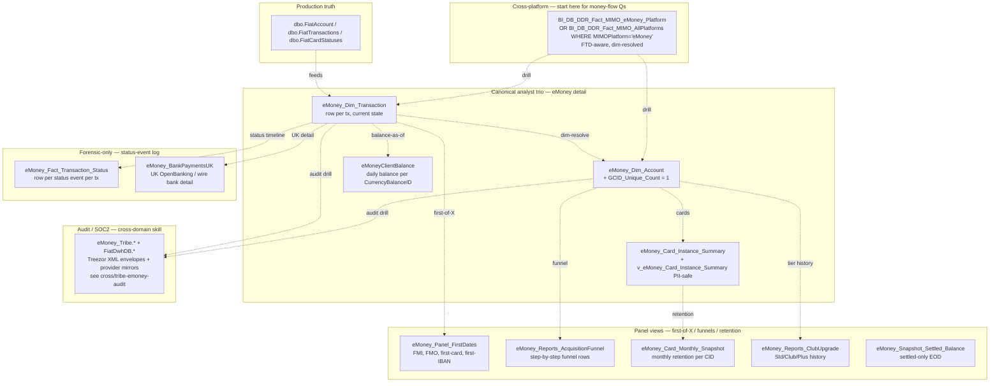

# C.3 — eMoney Accounts & Cards (IBAN / e-money platform)

This skill is a **ranking + routing** layer for eToro Money questions. eMoney
is a **separate platform** from the trading-platform billing layer: its own
ledger, its own ID space (`AccountID`, `GCID`, `CurrencyBalanceID`), its own
state machines, its own provider partner (Treezor). It joins back to trading
via `CID = RealCID`, but a "deposit" on eMoney is a row in
`eMoney_Dim_Transaction`, **not** in `Fact_BillingDeposit`.

> **Genie / SQL note:** SQL examples in this skill use UC FQNs. Synapse names
> in prose / mermaid are aliases — see `primary_objects:` for the canonical
> UC FQN and table type. The eMoney MIMO slice
> (`main.etoro_kpi_prep.v_mimo_emoneyplatform`) is a **VIEW** over
> `bi_db.gold_sql_dp_prod_we_bi_db_dbo_bi_db_ddr_fact_mimo_allplatforms`.
> The Treezor audit envelopes / FiatDwhDB mirrors are in UC bronze under
> `main.emoney.bronze_fiatdwhdb_*` and `main.bi_db.bronze_fiatdwhdb_*` — see
> `cross/tribe-emoney-audit.md`. One Synapse-only object remains:
> `eMoney_Marketing_EmailTracking` (`_Not_Migrated`).

## The reach order (start at #1, descend only when needed)

| # | Reach for | Why | When to stop here |
|---|---|---|---|
| **0** | `BI_DB_DDR_Fact_MIMO_eMoney_Platform` *(C.2)* — or `BI_DB_DDR_Fact_MIMO_AllPlatforms WHERE MIMOPlatform='eMoney'` | The eMoney slice of the cross-platform panel. Already FTD-aware, dim-resolved, sign-corrected. Carries the eMoney action types as `MIMOAction` values, with `OrigIdentifier`/`TransactionID` pointing back to the source `eMoney_Dim_Transaction` row. | Question is about volumes / FTDs / counts at any aggregate, including eMoney IBAN inflows / outflows, OpenBanking deposits, internal-transfer share. **~80% of eMoney money-flow questions stop here.** |
| **1** | **`eMoney_Dim_Transaction` + `eMoney_Dim_Account` + `eMoneyClientBalance`** | The canonical analyst trio — eMoney has no `BI_DB_*` analyst-facing rollup like TP's `BI_DB_DepositWithdrawFee`; the dim tables ARE the analyst entry. `eMoney_Dim_Transaction` is the row-per-transaction grain, `eMoney_Dim_Account` (with `GCID_Unique_Count = 1`) is the account hub, `eMoneyClientBalance` is the daily balance per `CurrencyBalanceID`. | Question needs row-level eMoney detail with dim attributes — single-customer transaction forensics, AccountProgram-level breakdown, balance-as-of-date, IBAN-vs-card mix. **The default eMoney row table.** |
| **2** | **Panel views** — `eMoney_Panel_FirstDates`, `eMoney_Reports_AcquisitionFunnel`, `eMoney_Card_Monthly_Snapshot`, `eMoney_Reports_ClubUpgrade` | Pre-aggregated panels for the recurring eMoney KPIs: FMI / FMO / first-card / first-IBAN milestones, acquisition-funnel cohort tracking, monthly card retention, Club upgrade history. | Question is "first-X" / funnel / retention. Don't recompute — the panels apply the right exclusions and timezone normalisations. |
| **3** | **`eMoney_Fact_Transaction_Status`** | True state-event log — one row per status transition per transaction. Unlike its TP cousin (`Fact_Deposit_State`), this IS the right place for analyst-facing "why did this transaction fail" / "when did it post" forensics — it's the eMoney status timeline. | Per-transaction status forensics, dispute investigation, latency analysis between status events. |
| **4** | `eMoney_BankPaymentsUK` | UK-specific OpenBanking + domestic wire feed. Its rows feed `eMoney_Dim_Transaction` but carry UK-bank-specific columns (sort code, payee bank). | UK-only OpenBanking / wire forensics where you need bank-side detail not in `eMoney_Dim_Transaction`. |
| **Audit** | `eMoney_Tribe.*` / `FiatDwhDB.*` | Treezor audit envelopes + provider-side fiat mirrors. Rich SOC2 detail. | **Don't reach here from this skill.** Load `cross/tribe-emoney-audit.md` instead — it owns the audit-trail map and provides the join keys. |
| **Recon** | `dbo.FiatAccount` / `dbo.FiatTransactions` / `dbo.FiatCardStatuses` *(production OLTP)* | Truth source. | Only when reconciling against production OLTP. Almost never needed — `FiatDwhDB` (Tribe cross-domain skill) is the better recon target. |

**The cardinal rule**: eMoney questions about money flow start at MIMO; questions about account/customer/card detail start at the dim trio; first-of-X questions go to `eMoney_Panel_FirstDates`. Don't cascade through state events for a question that didn't ask "why did this fail."

## Mental model (right-side-up pyramid)



## Canonical joins

> SQL below uses **Unity Catalog FQNs** so Databricks Genie can run them as-is.

```sql
-- Single-customer eMoney 360 (Tier 1) — DEDUPED
SELECT dt.TxDateID, dt.TransactionID, dt.Amount, dt.Currency,
       dtt.TransactionTypeName, dts.TransactionStatusName,
       da.AccountProgram, da.AccountSubProgram,
       dt.IsCryptoToFiat, dt.IsIBANQuickTransfer, dt.IsInternalTransfer
FROM main.bi_db.gold_sql_dp_prod_we_emoney_dbo_emoney_dim_transaction dt
JOIN main.bi_db.gold_sql_dp_prod_we_emoney_dbo_emoney_dim_account     da
       ON da.CID = dt.CID
      AND da.GCID_Unique_Count = 1                     -- mandatory dedup
JOIN main.emoney.gold_sql_dp_prod_we_emoney_dbo_emoney_dictionary_transactiontype   dtt
       ON dtt.TransactionTypeID   = dt.TransactionTypeID
JOIN main.emoney.gold_sql_dp_prod_we_emoney_dbo_emoney_dictionary_transactionstatus dts
       ON dts.TransactionStatusID = dt.TransactionStatusID
JOIN main.dwh.gold_sql_dp_prod_we_dwh_dbo_dim_regulation dr  ON dr.DWHRegulationID = dt.RegulationIDTxDate
JOIN main.dwh.gold_sql_dp_prod_we_dwh_dbo_dim_country    dco ON dco.CountryID      = dt.CountryIDTxDate
WHERE dt.CID = :cid
  AND dt.TxDateID BETWEEN :from_dt AND :to_dt
ORDER BY dt.TxDateID
```

```sql
-- Daily balance per customer (canonical eMoney balance, not derived)
SELECT *
FROM main.bi_db.gold_sql_dp_prod_we_emoney_dbo_emoneyclientbalance cb
JOIN main.bi_db.gold_sql_dp_prod_we_emoney_dbo_emoney_dim_account  da
       ON da.CurrencyBalanceID = cb.CurrencyBalanceID
      AND da.GCID_Unique_Count = 1
WHERE cb.SnapshotDate = :as_of
  AND da.IsValidETM = 1
```

```sql
-- Acquisition funnel + first-date panel (Tier 2 — single CID 360)
SELECT af.*, fd.FMI_Date, fd.FMO_Date, fd.FirstCardUseDate, fd.FirstIBANDepositDate,
       da.AccountProgram, da.AccountStatus
FROM main.bi_db.gold_sql_dp_prod_we_emoney_dbo_emoney_reports_acquisitionfunnel af
LEFT JOIN main.bi_db.gold_sql_dp_prod_we_emoney_dbo_emoney_panel_firstdates    fd
       ON fd.CID = af.CID
LEFT JOIN main.bi_db.gold_sql_dp_prod_we_emoney_dbo_emoney_dim_account         da
       ON da.GCID = af.GCID AND da.GCID_Unique_Count = 1
WHERE af.CID = :cid
```

```sql
-- "Why did transaction X fail" — Tier 3 status timeline
SELECT *
FROM main.bi_db.gold_sql_dp_prod_we_emoney_dbo_emoney_fact_transaction_status
WHERE TransactionID = :tx
ORDER BY EventDate
```

## KPI / pattern catalog

| Question | Reach for | Pattern |
|---|---|---|
| Cross-platform IBAN inflow / outflow volume | **MIMO** *(C.2)* | `WHERE MIMOPlatform='eMoney' AND MIMOAction IN ('Deposit','Withdraw') GROUP BY DateID, MIMOActionType` |
| eMoney FTD count | **MIMO** *(C.2)* | `WHERE MIMOPlatform='eMoney' AND IsPlatformFTD = 1 GROUP BY DateID` |
| Single-customer eMoney transactions | **`eMoney_Dim_Transaction`** | row-level query above; dedupe `Dim_Account` on `GCID_Unique_Count=1`. |
| Daily balance per customer/program | **`eMoneyClientBalance`** | snapshot table — never recompute from `SUM(Amount)`. |
| Settled-only balance | **`eMoney_Snapshot_Settled_Balance`** | excludes pending. |
| Active eMoney customers | **`eMoney_Dim_Account`** | `WHERE IsValidETM = 1 AND AccountStatus = 'Active' GROUP BY AccountProgram`. |
| eMoney FMI / FMO / first card | **`eMoney_Panel_FirstDates`** | one row per CID; don't derive from `MIN(TxDate)` — exclusions baked in. |
| Acquisition funnel cohort tracking | **`eMoney_Reports_AcquisitionFunnel`** | one row per CID per funnel step. |
| Monthly card retention | **`eMoney_Card_Monthly_Snapshot`** | pre-aggregated. |
| Std → Club → Plus upgrade chain per CID | **`eMoney_Reports_ClubUpgrade`** | ordered by upgrade date. |
| Card lifecycle (issue → activate → block → expire) | **`eMoney_Card_Instance_Summary`** | row per card instance per CID; **use `v_eMoney_Card_Instance_Summary` to avoid `MaskedPAN` PII**. |
| IBAN Quick Transfer count | **`eMoney_Dim_Transaction`** | `WHERE IsIBANQuickTransfer = 1` (= `MoveMoneyReasonID = 6`). |
| Crypto-to-Fiat into IBAN | **`eMoney_Dim_Transaction`** | `WHERE TransactionTypeID = 14` (= `IsCryptoToFiat = 1`). For full E2E flow → `cross/crypto-to-fiat`. |
| OpenBanking deposit detection | **`eMoney_Dim_Transaction` + `External_MoneyTransfer_Billing_Transfers`** | The dim row alone doesn't say OpenBanking; you need `(IsInternalTransfer=0 AND IsIBANTrade=0 AND EXISTS row in External_MoneyTransfer_Billing_Transfers WITH TransferStatusID=10) THEN 'OpenBanking' ELSE 'WireTransfer'`. See MIMO sub-skill gotcha #11. |
| UK bank-side detail (sort code, payee bank) | **`eMoney_BankPaymentsUK`** | UK-only; other regions don't have an equivalent. |
| Status timeline / failure forensics | **`eMoney_Fact_Transaction_Status`** | one row per status event; pivot for SLA analysis. |
| FX spread / OpenBanking conversion fee revenue | **Revenue & Fees super-domain** | `v_revenue_conversionfee*` — leave this skill. |
| Operator audit trail / SOC2 | **`cross/tribe-emoney-audit`** | this skill supplies the join keys; the cross-domain skill owns the Tribe map. |

## Gotchas

1. **`GCID_Unique_Count = 1` is mandatory on every join to `eMoney_Dim_Account`.** Multiple GCID-mappings exist for some CIDs; this filter selects the canonical row. Skip it and you double-count.
2. **`CID = RealCID` everywhere** — joins to `Dim_Customer` use `dc.RealCID = dt.CID` (not GCID, not AccountID).
3. **`eMoneyClientBalance` is the SOURCE OF TRUTH for eMoney balance.** Don't compute from `SUM(Amount)` over `eMoney_Dim_Transaction` — pending and settled differ.
4. **Use `IsValidETM = 1` to filter to "real" eMoney customers.** Without this you pick up partial onboardings, deleted accounts, etc.
5. **Use `RegulationIDTxDate` / `CountryIDTxDate`** (snapshot at transaction time) for transaction-level slicing — not the current `RegulationID` from `eMoney_Dim_Account`. A customer can change regulation; transactions are stamped at the time.
6. **Crypto-to-Fiat tag**: `eMoney_Dim_Transaction.TransactionTypeID = 14` is the canonical C2F flag on eMoney side. The MIMO panel mirrors this as `IsCryptoToFiat = 1`. For full C2F flow → cross-domain skill `crypto-to-fiat`.
7. **IBAN Quick Transfer ≠ TP Internal Transfer.** `IsIBANQuickTransfer` is eMoney-side `MoveMoneyReasonID = 6`. `IsInternalTransfer` (on TP MIMO rows) is TP-side TP↔eMoney move. Both should be excluded for "real" external money flow.
8. **`eMoney_BankPaymentsUK` is UK-only** — OpenBanking + UK domestic wires. Other regions don't have the same separate table.
9. **Card PII**: `eMoney_Card_Instance_Summary` exposes `MaskedPAN`. Use `v_eMoney_Card_Instance_Summary` (same grain, `MaskedPAN` excluded) for analytics. Marketing tables (`_EmailTracking`, `_UserData_Marketing`) are likewise PII-heavy.
10. **The dictionaries are CACHED in production.** If a `TransactionTypeID` doesn't decode, the prod cache may have new entries not yet synced to the dictionary tables. Treat unknowns gracefully: `COALESCE(decoded_name, 'Unknown_'||CAST(TypeID AS VARCHAR))`.
11. **`eMoney_Fact_Transaction_Status` is the RIGHT place for status forensics** — unlike its TP cousin `Fact_Deposit_State` (which is QA-only). The eMoney status fact is genuinely a state-event log; query it directly for "why did it fail" / "when did it post."
12. **No `BI_DB_*` rollup for eMoney.** Don't go looking for an `BI_DB_eMoneyDepositWithdrawFee`-style canonical view — it doesn't exist. The dim tables ARE the analyst layer; the cross-platform rollup is MIMO.

## When to bridge / drill out

| If the question also asks about… | …go to… |
|---|---|
| Cross-platform money flow (TP + eMoney + Crypto + Options) | [`mimo-panel-and-ddr.md`](mimo-panel-and-ddr.md) (C.2) |
| Trading-platform fiat deposits/withdrawals (NOT eMoney) | [`deposits-and-withdrawals.md`](deposits-and-withdrawals.md) (C.1) |
| Customer balance ALSO from trading + crypto + options | [`finance-recon-and-balances.md`](finance-recon-and-balances.md) (C.5) |
| **eMoney FX spread / OpenBanking conversion fee revenue** | [revenue-and-fees](../revenue-and-fees/SKILL.md) (`v_revenue_conversionfee*`) |
| Crypto came in → converted to EUR/USD on IBAN | [`../cross/crypto-to-fiat.md`](../cross/crypto-to-fiat.md) |
| **Operator / SOC2 audit trail / Tribe forensics** | [`../cross/tribe-emoney-audit.md`](../cross/tribe-emoney-audit.md) — owns the Tribe / FiatDwhDB map. This skill supplies the join keys (`AccountID`, `GCID`, `TransactionID`, `CardID`). |
| Chargeback / refund forensics | [`../cross/refund-chargeback-chain.md`](../cross/refund-chargeback-chain.md) |

## Deep reads (column-level detail)

The skill above only encodes ranking + routing. Column-level descriptions and full enums live in the wikis (also cloned to UC column descriptions).

- [`eMoney_Dim_Account.md`](https://github.com/guyman-tr/Databricks_Knowledge/blob/master/knowledge/synapse/Wiki/eMoney_dbo/Tables/eMoney_Dim_Account.md)
- [`eMoney_Dim_Transaction.md`](https://github.com/guyman-tr/Databricks_Knowledge/blob/master/knowledge/synapse/Wiki/eMoney_dbo/Tables/eMoney_Dim_Transaction.md)
- [`eMoney_Fact_Transaction_Status.md`](https://github.com/guyman-tr/Databricks_Knowledge/blob/master/knowledge/synapse/Wiki/eMoney_dbo/Tables/eMoney_Fact_Transaction_Status.md)
- [`eMoneyClientBalance.md`](https://github.com/guyman-tr/Databricks_Knowledge/blob/master/knowledge/synapse/Wiki/eMoney_dbo/Tables/eMoneyClientBalance.md)
- [`eMoney_Panel_FirstDates.md`](https://github.com/guyman-tr/Databricks_Knowledge/blob/master/knowledge/synapse/Wiki/eMoney_dbo/Tables/eMoney_Panel_FirstDates.md)
- [`eMoney_Reports_AcquisitionFunnel.md`](https://github.com/guyman-tr/Databricks_Knowledge/blob/master/knowledge/synapse/Wiki/eMoney_dbo/Tables/eMoney_Reports_AcquisitionFunnel.md)
- [`eMoney_Card_Instance_Summary.md`](https://github.com/guyman-tr/Databricks_Knowledge/blob/master/knowledge/synapse/Wiki/eMoney_dbo/Tables/eMoney_Card_Instance_Summary.md) / [`v_eMoney_Card_Instance_Summary.md`](https://github.com/guyman-tr/Databricks_Knowledge/blob/master/knowledge/synapse/Wiki/eMoney_dbo/Tables/v_eMoney_Card_Instance_Summary.md)
- [`eMoney_BankPaymentsUK.md`](https://github.com/guyman-tr/Databricks_Knowledge/blob/master/knowledge/synapse/Wiki/eMoney_dbo/Tables/eMoney_BankPaymentsUK.md)

## Cluster provenance

- Cluster 17 from the Louvain partition (61 members, intra-cluster weight 266.0).
- Schema mix: `eMoney_dbo:30, dbo:8, Dictionary:7, BI_DB_dbo:6, eMoney_Dim_Account:3` (the latter is a known sub-schema).
- Edge sources: 100% wiki — eMoney has no Genie space coverage and no KPI views referencing it directly (other than via the MIMO eMoney platform table, which sits in C.2).
- Top out-cluster cross-domain edges: `Dim_Customer` (30.5), `Dim_Country` (11.0), `BI_DB_DDR_Fact_MIMO_eMoney_Platform` (10.0), `Fact_SnapshotCustomer` (8.5).
- See [`../_brief_cluster_17.md`](../_brief_cluster_17.md) for full member list.
