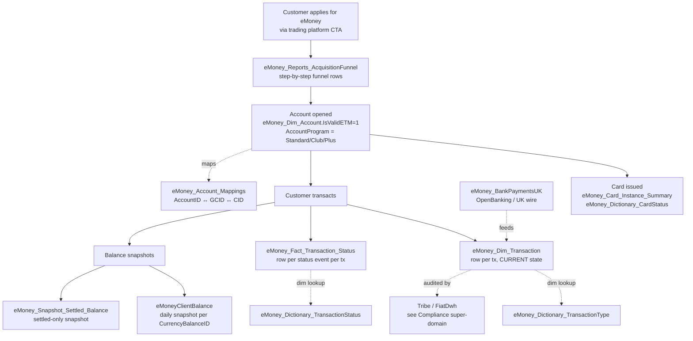

# C.3 — eMoney Accounts & Cards (IBAN / e-money platform)

eToro Money is a **separate platform** from the trading-platform billing
layer. It is its own ledger of accounts, transactions, balances and cards
(IBAN + debit card). It runs on its own state machines, has its own
acquisition funnel, and uses its own ID space (`AccountID`, `GCID`,
`CurrencyBalanceID`) — but joins back to the trading customer via
`CID = RealCID`.

**Do NOT route eMoney deposits to C.1.** A "deposit" on eMoney is a row in
`eMoney_Dim_Transaction`, not in `Fact_BillingDeposit`. The cross-platform
view that UNIONs both is the MIMO panel (C.2).

## Mental model



## Primary objects

| Object | Grain | Notes |
|--------|-------|-------|
| [`eMoney_Dim_Account`](../../synapse/Wiki/eMoney_dbo/Tables/eMoney_Dim_Account.md) | One row per account (with history versions); join with `GCID_Unique_Count=1` to dedupe to canonical row | The hub. Has `AccountID`, `CID`, `GCID`, `AccountProgram` (Std/Club/Plus), `AccountSubProgram`, `AccountStatus`, `IsValidETM`, `CurrencyBalanceID`, `RegulationID`, `CountryID`. **GCID is the eMoney-side primary identifier**; CID = RealCID joins to trading. |
| [`eMoney_Dim_Transaction`](../../synapse/Wiki/eMoney_dbo/Tables/eMoney_Dim_Transaction.md) | One row per transaction, current state | Has `TransactionID`, `CID`, `TransactionTypeID`, `TransactionStatusID`, `Amount`, `Currency`, `RegulationIDTxDate`, `CountryIDTxDate`, `IsInternalTransfer`, `IsIBANTrade`, `IsCryptoToFiat`, `IsRecurring`, `IsIBANQuickTransfer`. The eMoney equivalent of `Fact_BillingDeposit`. |
| [`eMoney_Fact_Transaction_Status`](../../synapse/Wiki/eMoney_dbo/Tables/eMoney_Fact_Transaction_Status.md) | One row per status event per transaction | True state-event log (unlike its TP cousin `Fact_Deposit_State`). For drill-down on "why did this tx fail / when did it post". |
| [`eMoneyClientBalance`](../../synapse/Wiki/eMoney_dbo/Tables/eMoneyClientBalance.md) | Daily snapshot per `CurrencyBalanceID` | The **canonical eMoney balance**. Per currency per day. Don't compute balance from transaction sums. |
| [`eMoney_Snapshot_Settled_Balance`](../../synapse/Wiki/eMoney_dbo/Tables/eMoney_Snapshot_Settled_Balance.md) | Daily snapshot, **settled-only** | Excludes pending. Use for "actually-spendable" balance. |
| [`eMoney_Panel_FirstDates`](../../synapse/Wiki/eMoney_dbo/Tables/eMoney_Panel_FirstDates.md) | One row per CID | First-of-X milestones: FMI (First Money In), FMO (First Money Out), first card use, first IBAN deposit, first internal transfer. eMoney-side analog of `Dim_Customer.FTD*Date`. |
| [`eMoney_Card_Instance_Summary`](../../synapse/Wiki/eMoney_dbo/Tables/eMoney_Card_Instance_Summary.md) | One row per card instance per CID | Card-level detail: issue date, status, expiry, last-used. |
| [`v_eMoney_Card_Instance_Summary`](../../synapse/Wiki/eMoney_dbo/Tables/v_eMoney_Card_Instance_Summary.md) | View — same grain, dim-joined | Convenience view. |
| [`eMoney_Card_Monthly_Snapshot`](../../synapse/Wiki/eMoney_dbo/Tables/eMoney_Card_Monthly_Snapshot.md) | One row per CID per month | Monthly card-funnel snapshot for retention/reactivation analysis. |
| [`eMoney_Reports_AcquisitionFunnel`](../../synapse/Wiki/eMoney_dbo/Tables/eMoney_Reports_AcquisitionFunnel.md) | One row per CID per funnel step | Acquisition funnel: applied → KYC → approved → first deposit → first card use. |
| [`eMoney_BankPaymentsUK`](../../synapse/Wiki/eMoney_dbo/Tables/eMoney_BankPaymentsUK.md) | One row per UK bank payment | OpenBanking and UK-side wire transfers feeding eMoney IBANs. |
| [`eMoney_Account_Mappings`](../../synapse/Wiki/eMoney_dbo/Tables/eMoney_Account_Mappings.md) | AccountID ↔ GCID ↔ CID mapping | Resolution table when you need to walk between IDs. |
| [`eMoney_Marketing_EmailTracking`](../../synapse/Wiki/eMoney_dbo/Tables/eMoney_Marketing_EmailTracking.md) | Email send/open/click events | Marketing CRM tracking. |
| [`eMoney_UserData_Marketing`](../../synapse/Wiki/eMoney_dbo/Tables/eMoney_UserData_Marketing.md) | One row per CID, marketing attributes | Marketing-side enrichment + AM (account manager) mapping. |
| [`eMoney_Reports_ClubUpgrade`](../../synapse/Wiki/eMoney_dbo/Tables/eMoney_Reports_ClubUpgrade.md) | Club upgrade events | Standard → Club → Plus transitions. |

**Dictionaries** (always dim-resolve):
- `eMoney_Dictionary_AccountProgram` (Standard / Club / Plus)
- `eMoney_Dictionary_AccountSubProgram` (sub-tier within program)
- `eMoney_Dictionary_AccountStatus`
- `eMoney_Dictionary_CardStatus`
- `eMoney_Dictionary_TransactionType` — decode `TransactionTypeID`. Includes special types: `14` = Crypto-to-Fiat (drives `IsCryptoToFiat`), `6` = IBAN Quick Transfer (drives `IsIBANQuickTransfer` via `MoveMoneyReasonID`).
- `eMoney_Dictionary_TransactionStatus`

**Production OLTP** (don't query unless reconciling):
- `dbo.FiatAccount` — production-side account record
- `dbo.FiatTransactions` — production-side transactions
- `dbo.FiatCardStatuses` — production-side card status

## Canonical joins

```sql
-- eMoney transaction with full account context (DEDUPED)
FROM eMoney_dbo.eMoney_Dim_Transaction dt
JOIN eMoney_dbo.eMoney_Dim_Account     da
       ON da.CID = dt.CID
      AND da.GCID_Unique_Count = 1                     -- mandatory dedup
JOIN eMoney_dbo.eMoney_Dictionary_TransactionType   dtt
       ON dtt.TransactionTypeID = dt.TransactionTypeID
JOIN eMoney_dbo.eMoney_Dictionary_TransactionStatus dts
       ON dts.TransactionStatusID = dt.TransactionStatusID
JOIN DWH_dbo.Dim_Customer  dc ON dc.RealCID = dt.CID
JOIN DWH_dbo.Dim_Regulation dr ON dr.DWHRegulationID = dt.RegulationIDTxDate
JOIN DWH_dbo.Dim_Country    dco ON dco.CountryID = dt.CountryIDTxDate
WHERE dt.TxDateID BETWEEN @from AND @to
```

```sql
-- Daily balance per customer (canonical balance source for eMoney)
FROM eMoney_dbo.eMoneyClientBalance cb
JOIN eMoney_dbo.eMoney_Dim_Account da
       ON da.CurrencyBalanceID = cb.CurrencyBalanceID
      AND da.GCID_Unique_Count = 1
JOIN DWH_dbo.Dim_Customer dc ON dc.RealCID = da.CID
WHERE cb.SnapshotDate = @date
  AND da.IsValidETM = 1
```

```sql
-- Acquisition funnel + first-date milestones (single CID 360)
FROM eMoney_dbo.eMoney_Reports_AcquisitionFunnel af
LEFT JOIN eMoney_dbo.eMoney_Panel_FirstDates fd ON fd.CID = af.CID
LEFT JOIN eMoney_dbo.eMoney_Dim_Account da
       ON da.GCID = af.GCID
      AND da.GCID_Unique_Count = 1
LEFT JOIN DWH_dbo.Dim_Customer dc ON dc.RealCID = af.CID
WHERE af.CID = @cid
```

```sql
-- Card lifecycle (per CID, per card instance)
FROM eMoney_dbo.eMoney_Card_Instance_Summary cis
JOIN eMoney_dbo.eMoney_Dim_Account da
       ON da.CID = cis.CID
      AND da.GCID_Unique_Count = 1
JOIN eMoney_dbo.eMoney_Dictionary_CardStatus dcs
       ON dcs.CardStatusID = cis.CardStatusID
WHERE cis.CID = @cid
ORDER BY cis.CardIssueDate
```

## KPI / pattern catalog

| Question | Pattern |
|----------|---------|
| **eMoney FMI / first money in date per CID** | `eMoney_Panel_FirstDates.FMI_Date`. Don't derive from `MIN(TxDate)`. |
| **eMoney IBAN deposit volume by country** | `eMoney_Dim_Transaction WHERE TransactionTypeID = <IBAN deposit type> GROUP BY CountryIDTxDate` joined to `Dim_Country`. **For cross-platform IBAN volume use C.2 MIMO with `MIMOPlatform='eMoney'`.** |
| **OpenBanking-tagged deposits** | The eMoney row alone doesn't say OpenBanking — you compute it as `(IsInternalTransfer=0 AND IsIBANTrade=0 AND EXISTS row in External_MoneyTransfer_Billing_Transfers WITH TransferStatusID=10) THEN 'OpenBanking' ELSE 'WireTransfer'`. See MIMO sub-skill gotcha #11. |
| **Active eMoney customers** | `eMoney_Dim_Account WHERE IsValidETM = 1 AND AccountStatus = 'Active'` (use the dim) `GROUP BY AccountProgram`. |
| **Settled balance by program** | `eMoney_Snapshot_Settled_Balance` joined to `eMoney_Dim_Account` joined to `eMoney_Dictionary_AccountProgram`. |
| **IBAN Quick Transfer count** | `WHERE IsIBANQuickTransfer = 1` on `eMoney_Dim_Transaction` (= `MoveMoneyReasonID = 6`). |
| **Card activation rate** | `eMoney_Card_Instance_Summary` joined to `eMoney_Reports_AcquisitionFunnel` to compute (issued → activated) per cohort. |
| **Standard → Club → Plus upgrade history per CID** | `eMoney_Reports_ClubUpgrade` ordered by upgrade date. |
| **Why did transaction X fail** | `eMoney_Fact_Transaction_Status WHERE TransactionID = @tx ORDER BY EventDate` for full status timeline. |

## Gotchas

1. **`GCID_Unique_Count = 1` is mandatory on every join to `eMoney_Dim_Account`.** Multiple GCID-mappings exist for some CIDs; this filter selects the canonical row. Skip it and you double-count.
2. **`CID = RealCID` everywhere** — joins to `Dim_Customer` use `dc.RealCID = dt.CID` (not GCID, not AccountID).
3. **`eMoneyClientBalance` is the SOURCE OF TRUTH for eMoney balance.** Don't compute from `SUM(Amount)` over `eMoney_Dim_Transaction` — pending and settled differ.
4. **Use `IsValidETM = 1` to filter to "real" eMoney customers.** Without this you pick up partial onboardings, deleted accounts, etc.
5. **Use `RegulationIDTxDate` / `CountryIDTxDate`** (snapshot at transaction time) for transaction-level slicing — not the current `RegulationID` from `eMoney_Dim_Account`. A customer can change regulation; transactions are stamped at the time.
6. **Crypto-to-Fiat tag**: `eMoney_Dim_Transaction.TransactionTypeID = 14` is the canonical C2F flag on eMoney side. The MIMO panel mirrors this as `IsCryptoToFiat = 1`. For full C2F flow analysis → bridge `crypto-to-fiat`.
7. **IBAN Quick Transfer ≠ TP Internal Transfer.** `IsIBANQuickTransfer` is eMoney-side `MoveMoneyReasonID = 6`. `IsInternalTransfer` (on TP MIMO rows) is TP-side TP↔eMoney move. Both should be excluded for "real" external money flow.
8. **`eMoney_BankPaymentsUK` is UK-only** — OpenBanking + UK domestic wires. Other regions don't have the same separate table.
9. **Marketing tables (`_EmailTracking`, `_UserData_Marketing`) are PII-heavy.** Same masking rules as `Dim_Customer` apply.
10. **The dictionaries are CACHED in production.** If a `TransactionTypeID` doesn't decode, the prod cache may have new entries not yet synced to the dictionary tables. Treat unknowns gracefully (`COALESCE(decoded_name, 'Unknown_'||CAST(TypeID AS VARCHAR))`).

## Tribe — the audit-trail proxy

`FiatDwhDB.Tribe` and `eMoney_Tribe.*` are SOC2-grade audit logs of every
operator/system action on eMoney accounts. They live in the **Compliance
super-domain** but are best **PROXIED via these eMoney objects**:

- To find Tribe events for a customer: start from `eMoney_Dim_Account.GCID`,
  use that GCID to query Tribe.
- To enrich a Tribe row with business context: join the Tribe `TransactionID`
  / `AccountID` back to `eMoney_Dim_Transaction` / `eMoney_Dim_Account` for
  amounts, currencies, status.

When a question is "who actually authorized this transaction" or "show me
the audit trail for account X" → load the Compliance super-domain skill +
this skill (C.3 supplies the join keys).

## When to bridge / drill out

| If the question also asks about… | …go to… |
|---------------------------------|---------|
| Cross-platform money flow (TP + eMoney + Crypto + Options) | [`mimo-panel-and-ddr.md`](mimo-panel-and-ddr.md) (C.2) |
| Trading-platform fiat deposits/withdrawals (NOT eMoney) | [`deposits-and-withdrawals.md`](deposits-and-withdrawals.md) (C.1) |
| Customer balance ALSO from trading + crypto + options | [`finance-recon-and-balances.md`](finance-recon-and-balances.md) (C.5) |
| **eMoney FX spread / OpenBanking conversion fee revenue** | [revenue-and-fees](../revenue-and-fees/SKILL.md) (`v_revenue_conversionfee*`) |
| Crypto came in → converted to EUR/USD on IBAN | [`../bridges/crypto-to-fiat.md`](../bridges/crypto-to-fiat.md) |
| Operator / SOC2 audit trail for an account | D. Compliance & AML (use Tribe; C.3 supplies join keys) |
| Chargeback / refund forensics | [`../bridges/refund-chargeback-chain.md`](../bridges/refund-chargeback-chain.md) |

## Deep reads

- [`eMoney_Dim_Account.md`](../../synapse/Wiki/eMoney_dbo/Tables/eMoney_Dim_Account.md)
- [`eMoney_Dim_Transaction.md`](../../synapse/Wiki/eMoney_dbo/Tables/eMoney_Dim_Transaction.md)
- [`eMoney_Fact_Transaction_Status.md`](../../synapse/Wiki/eMoney_dbo/Tables/eMoney_Fact_Transaction_Status.md)
- [`eMoneyClientBalance.md`](../../synapse/Wiki/eMoney_dbo/Tables/eMoneyClientBalance.md)
- [`eMoney_Panel_FirstDates.md`](../../synapse/Wiki/eMoney_dbo/Tables/eMoney_Panel_FirstDates.md)
- [`eMoney_Reports_AcquisitionFunnel.md`](../../synapse/Wiki/eMoney_dbo/Tables/eMoney_Reports_AcquisitionFunnel.md)

## Cluster provenance

- Cluster 17 from the Louvain partition (61 members, intra-cluster weight 266.0).
- Schema mix: `eMoney_dbo:30, dbo:8, Dictionary:7, BI_DB_dbo:6, eMoney_Dim_Account:3` (the latter is a known sub-schema).
- Edge sources: 100% wiki — eMoney has no Genie space coverage and no KPI views referencing it directly (other than via the MIMO eMoney platform table which sits in C.2).
- Top out-cluster bridges: `Dim_Customer` (30.5), `Dim_Country` (11.0), `BI_DB_DDR_Fact_MIMO_eMoney_Platform` (10.0), `Fact_SnapshotCustomer` (8.5).
- See [`../_brief_cluster_17.md`](../_brief_cluster_17.md) for full member list.
