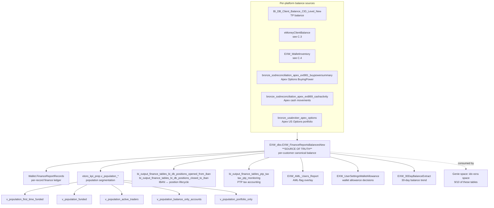

# C.5 — Finance Recon & Balances

The canonical answer to **"what is this customer's balance right now"** and
**"how does the company's books reconcile against external partners"**.
Owned by the Finance team (Ido Ezra). Most analytical questions about
customer net-worth-to-eToro, AUM, population segmentation
(funded / portfolio-only / active / balance-only), and external partner
reconciliation (Apex options, IBAN-side positions) live here.

This is intentionally a **THIN, well-curated** sub-skill. Most of its
power comes from the Genie space `ido ezra space` which covers 9/10 of the
canonical tables — and from the `etoro_kpi_prep.v_population_*` view family
which has already encoded the population segmentation logic.

## Mental model



## Primary objects

| Object | Grain | Notes |
|--------|-------|-------|
| [`EXW_dbo.EXW_FinanceReportsBalancesNew`](../../synapse/Wiki/EXW_dbo/Tables/EXW_FinanceReportsBalancesNew.md) | One row per customer per report period | **THE canonical balance table.** Joins to `EXW_DimUser` (GCID), `EXW_AML_Users_Report` (AML flag), `EXW_UserSettingsWalletAllowance` (wallet allowance). |
| [`EXW_dbo.EXW_30DayBalanceExtract`](../../synapse/Wiki/EXW_dbo/Tables/EXW_30DayBalanceExtract.md) | One row per customer per day, last 30 days | Rolling 30-day balance trend. |
| `EXW_dbo.EXW_AML_Users_Report` | AML status per user | Compliance overlay. |
| `EXW_dbo.EXW_UserSettingsWalletAllowance` | Wallet allowance settings per user | Operational gating. |
| `Wallet.FinanceReportRecords` *(production OLTP)* | Per-record finance ledger | Production-side source for `EXW_FinanceReportsBalancesNew`. |
| [`BI_DB_dbo.BI_DB_Client_Balance_CID_Level_New`](../../synapse/Wiki/BI_DB_dbo/Tables/BI_DB_Client_Balance_CID_Level_New.md) | TP-side per-CID balance, daily | Trading-platform balance feed into the finance recon view. |
| `bi_output.bi_output_finance_tables_bi_db_positions_opened_from_iban` *(UC)* | Position-open events sourced from IBAN funding | "I funded my IBAN, opened a CFD with that money" — the bridge between eMoney IBAN deposit and trading position opening, captured FOR FINANCE. |
| `bi_output.bi_output_finance_tables_bi_db_positions_closed_to_iban` *(UC)* | Position-close events that route money back to IBAN | Reverse direction. |
| `bi_output.bi_output_finance_tables_ptp_tax` *(UC)* | PTP tax accounting | Per-CID tax calculation for PTP (Publicly Traded Partnership) instruments. |
| `bi_output.bi_output_finance_tables_tax_ptp_monitoring` *(UC)* | PTP tax monitoring | Companion to the above. |
| `finance.bronze_sodreconciliation_apex_ext869_cashactivity` *(UC)* | Apex cash activity recon | Daily reconciliation feed from Apex (US options broker) — cash side. |
| `general.bronze_sodreconciliation_apex_ext981_buypowersummary` *(UC)* | Apex BuyingPower per user per day | Apex US Options buying power snapshot. |
| `general.bronze_usabroker_apex_options` *(UC)* | Apex US Options portfolio holdings | Per-user options inventory. |

**Population segmentation views** (canonical population definitions —
ALWAYS reuse these instead of redefining):

| View | Definition |
|------|------------|
| `etoro_kpi_prep.v_population_first_time_funded` | Customers who made their first deposit (cross-platform) — joins `v_mimo_allplatforms`, `v_globalftdplatform`, `Dim_Customer`, with `REMOVE_BAD_FTDS` exclusion. |
| `etoro_kpi_prep.v_population_funded` | Customers who currently have a non-zero balance — joins TP balance + eMoney balance + Options AUM + first-time-funded universe. |
| `etoro_kpi_prep.v_population_active_traders` | Customers who actively trade — joins `Fact_CustomerAction` + revenue + position data. |
| `etoro_kpi_prep.v_population_balance_only_accounts` | Customers with cash balance but no open positions. |
| `etoro_kpi_prep.v_population_portfolio_only` | Customers with open positions but no free cash. |
| `etoro_kpi_prep.v_options_aum` | Options AUM per user per day (via Apex BuyingPower + first-funding). |
| `etoro_kpi_prep.v_fact_customeraction_enriched` | Enriched customer action stream with passive vs active classification. |
| `etoro_kpi_prep.v_fact_customeraction_w_metrics` | Customer-action stream with revenue / fee metrics joined. |

## Canonical joins

```sql
-- Canonical customer balance per Finance (single CID, current snapshot)
FROM EXW_dbo.EXW_FinanceReportsBalancesNew frb
JOIN EXW_dbo.EXW_DimUser du ON du.GCID = frb.GCID
LEFT JOIN EXW_dbo.EXW_AML_Users_Report aml ON aml.GCID = frb.GCID
LEFT JOIN EXW_dbo.EXW_UserSettingsWalletAllowance ua ON ua.GCID = frb.GCID
WHERE frb.GCID = @gcid
  AND frb.ReportDate = @date
```

```sql
-- Population: who is currently funded
SELECT *
FROM etoro_kpi_prep.v_population_funded
WHERE SnapshotDate = @date
```

```sql
-- TP-side balance per CID per day (feeds into Finance recon)
FROM BI_DB_dbo.BI_DB_Client_Balance_CID_Level_New cb
JOIN DWH_dbo.Dim_Customer dc ON dc.RealCID = cb.CID
WHERE cb.SnapshotDate = @date
  AND cb.CID = @cid
```

```sql
-- IBAN ↔ position lifecycle (the eMoney IBAN ↔ TP positions story for finance)
FROM bi_output.bi_output_finance_tables_bi_db_positions_opened_from_iban op
WHERE op.OpenDateID BETWEEN @from AND @to

UNION ALL

SELECT *
FROM bi_output.bi_output_finance_tables_bi_db_positions_closed_to_iban cl
WHERE cl.CloseDateID BETWEEN @from AND @to
```

```sql
-- Apex options recon: cash activity vs BuyingPower vs portfolio
FROM finance.bronze_sodreconciliation_apex_ext869_cashactivity ca
LEFT JOIN general.bronze_sodreconciliation_apex_ext981_buypowersummary bp
       ON bp.AccountId = ca.AccountId
      AND bp.ReportDate = ca.ReportDate
LEFT JOIN general.bronze_usabroker_apex_options opt
       ON opt.AccountId = ca.AccountId
      AND opt.ReportDate = ca.ReportDate
WHERE ca.ReportDate = @date
```

## KPI / pattern catalog

| Question | Pattern |
|----------|---------|
| **Customer canonical balance right now** | `EXW_FinanceReportsBalancesNew` filter latest `ReportDate`. Use the **Finance-owned** view; don't sum across platforms yourself. |
| **Funded population on date X** | `etoro_kpi_prep.v_population_funded WHERE SnapshotDate = @date`. |
| **First-time funded customers in period** | `etoro_kpi_prep.v_population_first_time_funded WHERE FundingDateID BETWEEN @from AND @to`. (Cross-platform; bad-FTD cohort already excluded.) |
| **Active vs balance-only vs portfolio-only segmentation** | Three separate population views. |
| **30-day balance trend per CID** | `EXW_30DayBalanceExtract`. |
| **Apex US Options AUM per customer** | `etoro_kpi_prep.v_options_aum`. |
| **PTP tax per CID** | `bi_output.bi_output_finance_tables_ptp_tax`. |
| **Apex cash activity recon vs internal book** | Join `bronze_sodreconciliation_apex_ext869_cashactivity` to internal balance — date-by-date difference is the recon gap. |
| **Wallet allowance gating** | `EXW_UserSettingsWalletAllowance` — operator-set wallet limits. |
| **AML-flagged users with non-zero balance** | `EXW_FinanceReportsBalancesNew` joined to `EXW_AML_Users_Report` filter on AML flag + balance > 0. |
| **Position opened from IBAN funding** | `bi_output_finance_tables_bi_db_positions_opened_from_iban` directly. (For richer position drill-down → Trading.) |

## Gotchas

1. **`EXW_FinanceReportsBalancesNew` is THE source of truth for the company's "we owe customer X this much" view.** Do not derive customer balance by summing transactions yourself — pending vs settled, multi-platform, FX conversion all matter and they're all baked in.
2. **GCID is the join key here**, not CID. Join to `EXW_DimUser.GCID`. Use `Dim_Customer.GCID = .GCID` only when you need TP-side context.
3. **Population views encode REMOVE_BAD_FTDS rules.** Don't bypass them; they're how Finance avoids the 13K bad-FTD cohort distortion.
4. **The `bi_output_finance_tables_*` are FINANCE OUTPUT tables**, not generic position tables. They're built specifically for the Finance team's IBAN-side reconciliation. For pure trading position questions go to A. Trading.
5. **Apex tables are bronze in UC** — meaning they're the raw daily reconciliation feed from Apex with minimal transformation. Cash activity and BuyingPower come on different files (`ext869` and `ext981`); join on `AccountId + ReportDate`.
6. **PTP tax** is a US-regulation thing for Publicly Traded Partnerships (MLPs etc.). The accounting is non-trivial — re-use the FINANCE-side view, don't reinvent.
7. **Genie `ido ezra space` covers 9/10 tables here.** When using a Genie/AI to query, this space already has the right joins encoded.
8. **`Wallet.FinanceReportRecords` is OLTP** — heavy and cross-platform. Don't query directly unless you're reconciling against the DWH copy.
9. **BalanceCID-level views (`BI_DB_Client_Balance_CID_Level_New`)** is TP-only. The cross-platform answer is `EXW_FinanceReportsBalancesNew`.
10. **`v_population_*` views are SLOW with wide date ranges.** Always filter by `SnapshotDate = @date` (single day) unless you specifically need a cohort-trend.

## When to bridge / drill out

| If the question also asks about… | …go to… |
|---------------------------------|---------|
| Per-platform balance breakdown (eMoney IBAN balance) | [`emoney-accounts-and-cards.md`](emoney-accounts-and-cards.md) (`eMoneyClientBalance`) |
| Per-platform balance breakdown (crypto inventory) | [`crypto-wallet.md`](crypto-wallet.md) (`EXW_WalletInventory`) |
| Customer realizable equity from open positions | A. Trading (`V_Liabilities`) |
| Net MIMO that drove this balance | [`mimo-panel-and-ddr.md`](mimo-panel-and-ddr.md) (C.2) |
| Provider statement vs internal recon | [`../bridges/provider-reconciliation.md`](../bridges/provider-reconciliation.md) |
| **Revenue per CID per period** | Revenue & Fees super-domain (`mv_revenue_trading`) |
| AML investigation case detail | D. Compliance & AML |

## Deep reads

- [`EXW_FinanceReportsBalancesNew.md`](../../synapse/Wiki/EXW_dbo/Tables/EXW_FinanceReportsBalancesNew.md)
- [`EXW_30DayBalanceExtract.md`](../../synapse/Wiki/EXW_dbo/Tables/EXW_30DayBalanceExtract.md)
- [`BI_DB_Client_Balance_CID_Level_New.md`](../../synapse/Wiki/BI_DB_dbo/Tables/BI_DB_Client_Balance_CID_Level_New.md) (if available)

## Cluster provenance

- Cluster 47 from the Louvain partition (30 members, intra-cluster weight 90.0).
- Schema mix: `etoro_kpi_prep:12, bi_output:5, bi_output_stg:3, EXW_dbo:2, finance:1, general:3, others`.
- Edge sources: `wiki:15, genie:45, kpi_prep:30` — **HEAVILY Genie-curated** (the highest Genie:wiki ratio in Payments).
- Genie space: **`ido ezra space` covers 9/10 of the cluster's tables** — this is essentially the Finance team's curated query workspace.
- Top out-cluster bridges: `Dim_Customer` (7.0), `Dim_Position` (5.0), `Dim_Mirror` (4.0), `mv_revenue_trading` (2.0 → Revenue & Fees), `eMoneyClientBalance` (2.0 → C.3), `BI_DB_Client_Balance_CID_Level_New` (3.0).
- See [`../_brief_cluster_47.md`](../_brief_cluster_47.md) for full member list.
