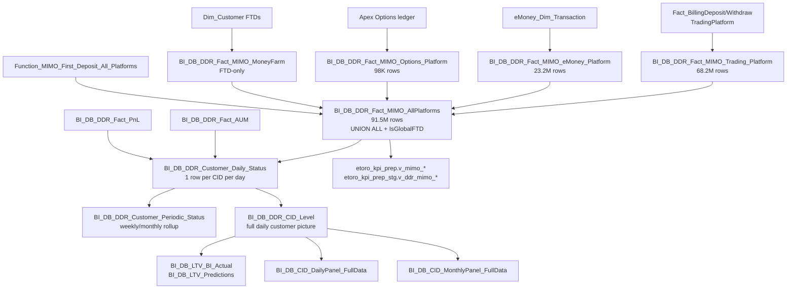

# C.2 — MIMO Panel & DDR (the cross-platform money flow layer)

This is the **single canonical answer** to "how much money flowed in / out".
The BI team built this layer precisely so analysts don't have to JOIN raw
billing tables across four platforms. Everything is pre-aggregated to
`(DateID, RealCID, MIMOPlatform, MIMOAction)` grain with FTD machinery
already applied.

**If you find yourself wanting to UNION ALL `Fact_BillingDeposit` +
`eMoney_Dim_Transaction` + `EXW_Wallet.SentTransactions` — STOP and use
this skill instead.**

## Mental model



The DDR layer has three tiers, in increasing aggregation:

1. **Transactional MIMO** — `BI_DB_DDR_Fact_MIMO_AllPlatforms` and the four
   sub-platform tables. Grain = one row per money movement.
2. **Daily customer panel** — `BI_DB_DDR_Customer_Daily_Status`,
   `BI_DB_DDR_Fact_AUM`, `BI_DB_DDR_Fact_PnL`,
   `BI_DB_DDR_Fact_Revenue_Generating_Actions`,
   `BI_DB_DDR_Fact_Trading_Volumes_And_Amounts`. Grain = one row per CID
   per DateID.
3. **Periodic / lifetime panels** — `BI_DB_DDR_Customer_Periodic_Status`,
   `BI_DB_CID_DailyPanel_FullData`, `BI_DB_CID_MonthlyPanel_FullData`,
   `BI_DB_LTV_*`. Grain = one row per CID per period (week/month/lifetime).

## Primary objects

| Object | Grain | Rows | Notes |
|--------|-------|------|-------|
| [`BI_DB_DDR_Fact_MIMO_AllPlatforms`](../../synapse/Wiki/BI_DB_dbo/Tables/BI_DB_DDR_Fact_MIMO_AllPlatforms.md) | Transaction × CID × Date × Platform × Action | 91.5M | HASH(RealCID), CCI. **The canonical "did money flow" table.** |
| [`BI_DB_DDR_Fact_MIMO_Trading_Platform`](../../synapse/Wiki/BI_DB_dbo/Tables/BI_DB_DDR_Fact_MIMO_Trading_Platform.md) | Same, TP only | 68.2M | Built from `Fact_BillingDeposit/Withdraw` + Dim resolution. |
| [`BI_DB_DDR_Fact_MIMO_eMoney_Platform`](../../synapse/Wiki/BI_DB_dbo/Tables/BI_DB_DDR_Fact_MIMO_eMoney_Platform.md) | Same, eMoney only | 23.2M | Built from `eMoney_Dim_Transaction` + status. |
| [`BI_DB_DDR_Fact_MIMO_Options_Platform`](../../synapse/Wiki/BI_DB_dbo/Tables/BI_DB_DDR_Fact_MIMO_Options_Platform.md) | Same, Options only | 98K | Apex/Gatsby broker; full delete/re-insert each run (data arrival is unreliable). |
| `Function_MIMO_First_Deposit_All_Platforms` | Function — returns one row per CID's FTD across all platforms | — | Source-of-truth for cross-platform FTD. **Excludes 13K bad-FTD cohort** (Aug 18-20 2025, $1 deposits with no follow-up). |
| [`BI_DB_DDR_Customer_Daily_Status`](../../synapse/Wiki/BI_DB_dbo/Tables/BI_DB_DDR_Customer_Daily_Status.md) | CID × DateID | — | The daily customer state: balance, AUM, PnL, MIMO, country, regulation. The **default daily customer rollup**. |
| [`BI_DB_DDR_Customer_Periodic_Status`](../../synapse/Wiki/BI_DB_dbo/Tables/BI_DB_DDR_Customer_Periodic_Status.md) | CID × Period | — | Weekly / monthly rollup of `_Daily_Status`. |
| [`BI_DB_DDR_CID_Level`](../../synapse/Wiki/BI_DB_dbo/Tables/BI_DB_DDR_CID_Level.md) | CID × DateID | — | Full daily picture (joins MIMO + AUM + PnL + RevenueActions). Most BI dashboards point here. |
| [`BI_DB_DDR_Fact_AUM`](../../synapse/Wiki/BI_DB_dbo/Tables/BI_DB_DDR_Fact_AUM.md) | CID × DateID | — | Assets-under-management snapshot per customer per day. |
| [`BI_DB_DDR_Fact_PnL`](../../synapse/Wiki/BI_DB_dbo/Tables/BI_DB_DDR_Fact_PnL.md) | CID × DateID × InstrumentType | — | Revenue per customer per day per instrument class. |
| [`BI_DB_DDR_Fact_Revenue_Generating_Actions`](../../synapse/Wiki/BI_DB_dbo/Tables/BI_DB_DDR_Fact_Revenue_Generating_Actions.md) | CID × DateID × ActionType × RevenueMetric | — | Granular revenue events (open / close / manual close). |
| [`BI_DB_DDR_Fact_Trading_Volumes_And_Amounts`](../../synapse/Wiki/BI_DB_dbo/Tables/BI_DB_DDR_Fact_Trading_Volumes_And_Amounts.md) | CID × DateID × InstrumentType | — | Volume + notional amounts per customer per day. |
| [`BI_DB_LTV_BI_Actual`](../../synapse/Wiki/BI_DB_dbo/Tables/BI_DB_LTV_BI_Actual.md) | CID × cohort | — | Realized LTV per customer cohort. |
| [`BI_DB_LTV_Predictions`](../../synapse/Wiki/BI_DB_dbo/Tables/BI_DB_LTV_Predictions.md) | CID × cohort | — | Predicted LTV. |
| [`BI_DB_CID_DailyPanel_FullData`](../../synapse/Wiki/BI_DB_dbo/Tables/BI_DB_CID_DailyPanel_FullData.md) | CID × DateID, ultra-wide | — | Convenience super-wide daily panel. |
| [`BI_DB_CID_MonthlyPanel_FullData`](../../synapse/Wiki/BI_DB_dbo/Tables/BI_DB_CID_MonthlyPanel_FullData.md) | CID × Month, ultra-wide | — | Convenience super-wide monthly panel. |

KPI views built on this layer (Unity Catalog):

- `etoro_kpi_prep.v_mimo_allplatforms` — direct UC mirror of the AllPlatforms fact
- `etoro_kpi_prep.v_mimo_tradingplatform` / `v_mimo_emoneyplatform` / `v_mimo_optionsplatform` — per-platform mirrors
- `etoro_kpi_prep.v_mimo_first_deposit_all_platforms` — UC mirror of the FTD function
- `etoro_kpi_prep_stg.v_ddr_mimo_allplatforms` / `v_ddr_mimo_emoney` / `v_ddr_mimo_options` / `v_ddr_mimo_tradingplatform` — staging variants
- `etoro_kpi.vg_ddr_revenue` — DDR revenue rollup

## Canonical joins

```sql
-- Daily MIMO with customer demographics (90% of analyst Qs)
FROM BI_DB_dbo.BI_DB_DDR_Fact_MIMO_AllPlatforms m
JOIN DWH_dbo.Dim_Customer    dc  ON dc.RealCID = m.RealCID
JOIN DWH_dbo.Dim_FundingType dft ON dft.FundingTypeID = m.FundingTypeID
JOIN DWH_dbo.Dim_Currency    dcu ON dcu.CurrencyID = m.CurrencyID
WHERE m.DateID BETWEEN @from AND @to
  AND m.MIMOAction = 'Deposit'
  AND m.MIMOPlatform = 'TradingPlatform'  -- or remove for cross-platform
```

```sql
-- Daily customer status with full enrichment
FROM BI_DB_dbo.BI_DB_DDR_Customer_Daily_Status cds
LEFT JOIN BI_DB_dbo.BI_DB_DDR_Fact_AUM    aum ON aum.RealCID = cds.RealCID AND aum.DateID = cds.DateID
LEFT JOIN BI_DB_dbo.BI_DB_DDR_Fact_PnL    pnl ON pnl.RealCID = cds.RealCID AND pnl.DateID = cds.DateID
LEFT JOIN BI_DB_dbo.BI_DB_DDR_Fact_MIMO_AllPlatforms m
       ON m.RealCID = cds.RealCID AND m.DateID = cds.DateID
JOIN DWH_dbo.Dim_Customer   dc  ON dc.RealCID = cds.RealCID
JOIN DWH_dbo.Dim_Regulation dr  ON dr.RegulationID = cds.RegulationID
JOIN DWH_dbo.Dim_Country    dco ON dco.CountryID = cds.CountryID
WHERE cds.DateID = @date
```

```sql
-- Full daily customer picture (preferred — already has MIMO + AUM + PnL + revenue actions)
FROM BI_DB_dbo.BI_DB_DDR_CID_Level cl
JOIN DWH_dbo.Dim_Customer dc ON dc.RealCID = cl.RealCID
WHERE cl.DateID BETWEEN @from AND @to
  AND cl.RealCID = @cid
```

```sql
-- Revenue events with metric definitions (instead of computing from PnL)
FROM BI_DB_dbo.BI_DB_DDR_Fact_Revenue_Generating_Actions r
JOIN BI_DB_dbo.Dim_Revenue_Metrics drm ON drm.RevenueMetricID = r.RevenueMetricID
JOIN DWH_dbo.Dim_ActionType        dat ON dat.ActionTypeID    = r.ActionTypeID    -- filter -1
JOIN DWH_dbo.Dim_InstrumentType    dit ON dit.InstrumentTypeID = r.InstrumentTypeID -- filter -1
WHERE r.DateID BETWEEN @from AND @to
```

## KPI / pattern catalog

| Question | Pattern |
|----------|---------|
| **Daily deposit volume by platform** | `WHERE MIMOAction='Deposit' GROUP BY DateID, MIMOPlatform`, `SUM(AmountUSD)` |
| **Net MIMO (deposit − withdraw)** | `SUM(CASE WHEN MIMOAction='Deposit' THEN AmountUSD ELSE -AmountUSD END)` — withdrawals are positive in this fact, so subtract on aggregation |
| **Global FTD count per day per platform** | `WHERE IsGlobalFTD=1 AND MIMOAction='Deposit' GROUP BY DateID, MIMOPlatform`. **Cross-platform unique first deposits.** |
| **Platform FTD count per day** | `WHERE IsPlatformFTD=1 AND MIMOAction='Deposit' GROUP BY DateID, MIMOPlatform`. Different from global — a customer can have eMoney FTD AFTER a TP FTD. |
| **Crypto-to-fiat deposit volume** | `WHERE IsCryptoToFiat=1 AND MIMOAction='Deposit'`. Dual-source flag (sub-platform + UPDATE). For the full conversion story → bridge `crypto-to-fiat`. |
| **Recurring-deposit penetration** | `COUNT(DISTINCT CASE WHEN IsRecurring=1 AND MIMOAction='Deposit' THEN RealCID END) * 1.0 / COUNT(DISTINCT RealCID)` |
| **IBAN-initiated trades (eMoney quick transfer)** | `WHERE MIMOPlatform='eMoney' AND IsTradeFromIBAN=1`. For the eMoney → trading deposit story specifically. |
| **Internal transfers (TP↔eMoney) excluded from "real" MIMO** | `AND IsInternalTransfer=0`. Always apply when measuring true money flow. |
| **AML net deposits (specific KPI)** | `SUM(CASE WHEN MIMOPlatform='TradingPlatform' AND MIMOAction='Deposit' AND FundingTypeID<>33 THEN AmountUSD END) - SUM(CASE WHEN MIMOPlatform='TradingPlatform' AND MIMOAction='Withdraw' AND FundingTypeID<>33 THEN AmountUSD END) + (eMoney inbound − outbound, exclude IsInternalTransfer=1)`. Used by AML team. `FundingTypeID=33` is excluded. |
| **MoneyFarm FTDs** | `WHERE MIMOPlatform='MoneyFarm'` — only FTDs appear here. `Currency='GBP'` is hardcoded. |
| **Daily customer count by status** | `BI_DB_DDR_Customer_Daily_Status GROUP BY DateID, Status` (use the Daily Status table, not raw MIMO, when the question is about the customer rather than the transaction) |
| **AUM per customer per day** | `BI_DB_DDR_Fact_AUM` directly. Don't derive from positions. |
| **Realized LTV by cohort** | `BI_DB_LTV_BI_Actual GROUP BY CohortMonth, RegulationID` — already cohorted. |

## Gotchas

1. **`AmountUSD` and `AmountOrigCurrency` may be NEGATIVE for withdrawals on TP** — depending on platform, withdraw rows can come in signed. **Always use `MIMOAction` to discriminate**, not the sign of `AmountUSD`. Use `ABS(AmountUSD)` if you want absolute.
2. **`IsGlobalFTD = 1` is the unique cross-platform FTD; `IsPlatformFTD = 1` is per-platform.** Use the right one. Counting `IsPlatformFTD` and treating them as unique customers will double-count any customer who FTD'd on multiple platforms.
3. **FTD recovery only applies to `DateID >= 20250901`.** Older periods may slightly under-count FTDs (the corrections have not been backfilled).
4. **13K bad-FTD cohort excluded** (Aug 18–20 2025): customers who deposited $1 and never came back. Excluded from `Function_MIMO_First_Deposit_All_Platforms`. Don't try to "recover" them.
5. **Options `TransactionID = 0`** is hardcoded for ALL Options rows (varchar/int incompatibility). Don't join on `TransactionID` for `MIMOPlatform='Options'`.
6. **MoneyFarm is FTD-only.** No subsequent deposits or withdrawals. `AmountOrigCurrency=-1`, `Currency='GBP'`, `FundingTypeID=-1` are sentinels. Always 0 for `IsRecurring/IsTradeFromIBAN/IsCryptoToFiat/IsRedeem/IsIBANQuickTransfer`.
7. **`IsInternalTransfer = 1`** = TP↔eMoney internal moves. **Always exclude these** when measuring "real" money flow into the company. If you DON'T exclude them you'll double-count (one row in TP `MIMOAction='Deposit'`, one row in eMoney `MIMOAction='Withdraw'`).
8. **`IsIBANQuickTransfer` is eMoney-side internal transfer (`MoveMoneyReasonID=6`)**, distinct from TP `IsInternalTransfer`. Both should be excluded for "real" flow.
9. **`FundingTypeID = 33` exclusion** in TP — used by AML team's Net Deposits KPI. Indicates non-cash / non-standard funding. Apply when reproducing AML numbers; otherwise leave in.
10. **`IsCryptoToFiat` had GAPS in TP tagging before 2025-07.** The post-insert UPDATE for `FundingTypeID=27` only runs `DateID >= 20250701`. Historical analyses may under-count C2F.
11. **eMoney MOP reclassification**: downstream Tableau dashboards override `Dim_FundingType.Name` for eMoney external deposits — they call it `'OpenBanking'` if there's a matching `External_MoneyTransfer_Billing_Transfers` row with `TransferStatusID=10`, else `'WireTransfer'`. The table itself doesn't carry this distinction; you compute it on read. For analyst-grade question accept the dim name; for OpenBanking-specific accuracy do the join.
12. **Don't join the four sub-platform tables yourself** — they UNION ALL into `_AllPlatforms` already. Joining them again is double-counting.
13. **`BI_DB_DDR_Customer_Daily_Status` has one row per CID per day**, even if the customer had no MIMO that day. So COUNT(*) on it is *active customer count*, not transaction count.
14. **`BI_DB_DDR_CID_Level` is the BIGGEST one-stop table** — joins MIMO + AUM + PnL + RevenueActions per CID per day. Prefer it over multi-table joins for "daily customer picture" questions.

## When to bridge / when to drill down

| If the question also asks about… | …go to… |
|---------------------------------|---------|
| **Provider-level / MID-level breakdown** | [`deposits-and-withdrawals.md`](deposits-and-withdrawals.md) — MIMO doesn't carry MID; you need raw `Fact_BillingDeposit`. |
| **3DS outcome, decline reason, payment status drill** | [`deposits-and-withdrawals.md`](deposits-and-withdrawals.md) — state-machine drill is in `Fact_Deposit_State`. |
| **eMoney-side IBAN, card, OpenBanking specifics** | [`emoney-accounts-and-cards.md`](emoney-accounts-and-cards.md) — MIMO doesn't carry eMoney transaction status. |
| **On-chain hash / wallet-side crypto transactions** | [`crypto-wallet.md`](crypto-wallet.md) |
| **Realtime customer balance** (vs the daily snapshot here) | [`finance-recon-and-balances.md`](finance-recon-and-balances.md) |
| **Fee revenue specifically** | [`fees-and-revenue.md`](fees-and-revenue.md) — MIMO has Amounts but not fee composition. |
| **Customer's first trade after FTD** | [`../bridges/recurring-deposit-to-trade.md`](../bridges/recurring-deposit-to-trade.md) |
| **Crypto deposit → fiat conversion chain** | [`../bridges/crypto-to-fiat.md`](../bridges/crypto-to-fiat.md) — `IsCryptoToFiat` flag is here, but the journey is in C.4 + C.3. |
| **Provider statement reconciliation** | [`../bridges/provider-reconciliation.md`](../bridges/provider-reconciliation.md) |

## Deep reads

- [`BI_DB_DDR_Fact_MIMO_AllPlatforms.md`](../../synapse/Wiki/BI_DB_dbo/Tables/BI_DB_DDR_Fact_MIMO_AllPlatforms.md) — full 21-column schema, FTD machinery, platform-specific transformations.
- [`BI_DB_DDR_Customer_Daily_Status.md`](../../synapse/Wiki/BI_DB_dbo/Tables/BI_DB_DDR_Customer_Daily_Status.md) — daily CID rollup columns.
- [`BI_DB_DDR_CID_Level.md`](../../synapse/Wiki/BI_DB_dbo/Tables/BI_DB_DDR_CID_Level.md) — the super-wide daily customer table that BI dashboards consume.
- [`BI_DB_DDR_Fact_Revenue_Generating_Actions.md`](../../synapse/Wiki/BI_DB_dbo/Tables/BI_DB_DDR_Fact_Revenue_Generating_Actions.md) — revenue event grain.

## Cluster provenance

- Cluster 13 from the Louvain partition (74 members, intra-cluster weight
  429.0).
- Schema mix: `BI_DB_dbo:41, DWH_dbo:7, eMoney_dbo:4, etoro_kpi[_prep]:5,
  spaceship:5, money_farm:1, bi_output:2, others`.
- Edge sources: `wiki:147, genie:191, tableau:144, kpi:11, kpi_prep:8` —
  highest Tableau / Genie weight in all of Payments (this layer is what
  dashboards and curated AI spaces consume).
- Genie spaces overlapping this cluster: `UK BA space [WIP]` (5/30 tables)
  — broad payments analytics. Most other Genies use the raw billing layer
  instead.
- KPI view coverage: `v_mimo_*` family + `v_ddr_mimo_*` family (these
  reference cluster 7 tables but conceptually belong here).
- See [`../_brief_cluster_13.md`](../_brief_cluster_13.md) for full member
  list and out-cluster bridge candidates.
