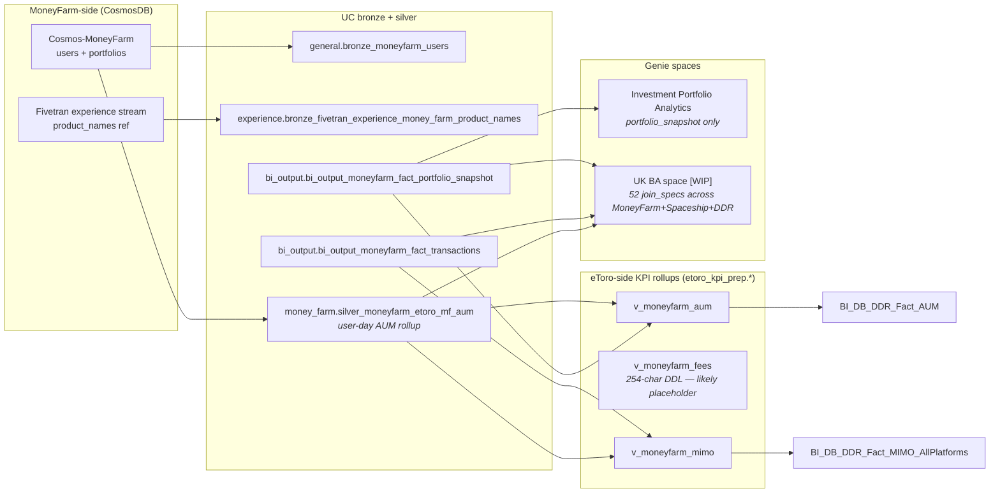

# MoneyFarm — UK / EU robo-advisor (Cosmos-sourced)

## What this domain is

MoneyFarm is a digital wealth management / robo-advisor platform headquartered in the UK that eToro acquired (2024 inferred from cluster timing). MoneyFarm runs its own production stack and ships data to our lake **only as a read-only feed**. Crucially, MoneyFarm's source contract is **CosmosDB document export** (`Cosmos-MoneyFarm` server, see `_generic_pipeline_mapping.json[generic_id=1168]`) — fundamentally different from Spaceship's BigQuery/Metabase contract. This shapes how the bronze tables look (key-value blobs vs relational shapes).

The eToro-side then builds three v_moneyfarm_* views in **`etoro_kpi_prep`** (not `etoro_kpi` like Spaceship — naming inconsistency to be aware of) plus two bizops fact tables in `bi_output`.

| Layer | UC Schema | Table family | What it is |
|-------|-----------|--------------|------------|
| Bronze (raw Cosmos) | `general.*` | `bronze_moneyfarm_users` | Raw user docs from Cosmos export (PII-bearing) |
| Silver (aggregated) | `money_farm.*` | `silver_moneyfarm_etoro_mf_aum` | Per-user AUM aggregation, the only `money_farm.*` table referenced in cluster-13 |
| Bronze (Fivetran aux) | `experience.*` | `bronze_fivetran_experience_money_farm_product_names` | MoneyFarm portfolio-product name reference |
| eToro-side bizops | `bi_output.*` | `bi_output_moneyfarm_fact_portfolio_snapshot`, `bi_output_moneyfarm_fact_transactions` | Two fact tables curated by the BI team for MoneyFarm reporting |
| eToro-side KPI | `etoro_kpi_prep.*` | `v_moneyfarm_aum`, `v_moneyfarm_fees`, `v_moneyfarm_mimo` | Three rollup views feeding DDR |

There is no source-SQL repository — only what shipped to UC.

## Mental model

## Cluster provenance

MoneyFarm sits inside **DDR/MIMO Cluster 13** alongside Spaceship and the eToro DDR fact tables (see `knowledge/skills/_brief_cluster_13.md`). Of the cluster's 70+ members, three are tagged as MoneyFarm:

- `money_farm.silver_moneyfarm_etoro_mf_aum` — primary silver AUM table (weight 38, the highest-traffic MoneyFarm node).
- `bi_output.bi_output_moneyfarm_fact_portfolio_snapshot` — eToro-side portfolio fact, weight 24.
- `bi_output.bi_output_moneyfarm_fact_transactions` — eToro-side transactions fact, weight 24.

The eToro-side identity bridge goes through `bi_db.bronze_sub_accounts_accounts` to map the MoneyFarm `user_id` to eToro `gcid`/`cid` (same bridge pattern Spaceship uses).

## Why this is a useful POC

The framework was prototyped on Spaceship which has an unusually rich UC comment on `v_spaceship_fees` and 3 anchor Confluence pages. MoneyFarm is the stress test:

| Lever | Spaceship | MoneyFarm (expected) |
|-------|-----------|----------------------|
| Source system | BigQuery (relational) | CosmosDB (NoSQL document) |
| Target schema for KPI views | `etoro_kpi.v_spaceship_*` | `etoro_kpi_prep.v_moneyfarm_*` |
| Pre-existing UC comments | 1 view with 9KB authored comment | likely none |
| Genie space coverage | 0 spaces | 3 spaces — Investment Portfolio Analytics + UK BA WIP + abandoned space |
| Tableau coverage | 0 hits | TBD — discover in P3 |
| Confluence coverage | 3 anchor pages | TBD — discover in P2 |

If the framework can produce a defensible wiki for `etoro_kpi_prep.v_moneyfarm_aum` (or another target chosen post-discovery) **without** the Tier-1 lifeline of a pre-authored UC comment, we know it generalises. The Tier-3 evidence from "UK BA space [WIP]" (52 join_specs) becomes the primary load-bearing source.

## Authoring policy

Object documentation under this folder follows the **UC-only Tier 1–4 policy** defined in `.cursor/rules/uc-domain-doc/05-generate-doc.mdc`:

| Tier | Anchor (UC-only domains) | DWH equivalent |
|------|--------------------------|----------------|
| 1 | Confluence page authored by domain owner / MoneyFarm-side PRD | SSDT comment + Tier-1 wiki |
| 2 | Tableau workbook captions, calc-fields, custom SQL touching the table | Phase 5/8 SP scan |
| 3 | Genie space `join_specs` / `text_instructions` / `sql_snippets` that reference the object | Phase 7 view-dep scan |
| 4 | Inferred from UC sampled values, naming convention, cluster brief | Phase 6 business-logic guesswork |
| `[UNVERIFIED]` | Pure agent inference | Same |

For MoneyFarm we expect **Tier-3 to be the primary anchor** (UK BA space WIP), with Tier-4 fallback to UC samples + cluster brief, since the source-system documentation is on the MoneyFarm side and likely not in eToro Confluence.

## Phase status

| Phase | Status | Output |
|-------|--------|--------|
| P0 Domain card | done | this file |
| P1 UC discovery | done | `_discovery/uc_inventory.json` (9 objects across 5 schemas, 82 columns) |
| P2 Confluence discovery | done | `_discovery/confluence_index.json` (4 cached pages — 3 Tier-1, 1 Tier-2) |
| P3 Tableau discovery | done | `_discovery/tableau_index.json` (0 hits across 9 objects — clean negative, despite a known CS Tableau dashboard "ISACustomerLookupDashboard") |
| P4 Databricks-native discovery | done | `_discovery/databricks_assets.json` (3 Genie spaces match: Investment Portfolio Analytics, **UK BA space [WIP]** with 16 join_specs, New Space; 1 ingest notebook MoneyFarm_Daily.ipynb) |
| P5 Doc generation pilot | done | `schemas/bi_output/Tables/bi_output_moneyfarm_fact_portfolio_snapshot.md` (chosen as it has the richest Tier-3 evidence in UK BA Genie space) |
| P6 Cross-object enrichment + UC deploy | deferred | `_deploy-index.md` |

## Discovery baseline (2026-05-04)

| Phase | Headline finding |
|-------|------------------|
| P1 UC | **9 UC objects** (6 EXTERNAL Delta tables + 3 views) across 5 schemas. **82 columns**, of which **24 (29 %)** carry UC comments — *much* better than Spaceship's 1.4 %, but the rich comments are confined to the 3 v_moneyfarm_* views (which have analyst-authored 150–250-char comments). The `bi_output.*` and `general/experience/money_farm.*` tables have **zero** column comments. Three additional objects appeared vs cluster-13 prediction: `bi_output_moneyfarm_customers` (96K rows), `bronze_fivetran_experience_money_farm_product_names` (9 rows reference table), `bronze_moneyfarm_users` (24K rows from CosmosDB with `_rid`/`_self`/`_etag`/`_attachments` metadata). |
| P2 Confluence | **3 Tier-1 + 1 Tier-2 anchor pages** retained from 30 title-match hits. The Tier-1 set is unusually rich — covers the entire pipeline: `Moneyfarm V2 - HLD` (XP, **eligibility rules**), `MF additions Deposit Event` (XP, **event schema and TransactionId hash**), `MoneyFarm global payments configurations` (MG, **AccountTypeID=4 = MoneyFarm**). Tier-2: `ISA - MoneyFarm For CS TLs` (CS, mentions a Tableau report). The remaining 26 hits are CTO-office meeting notes / NOC runbooks (low semantic value). |
| P3 Tableau | **Zero workbook / custom-SQL / calc-field hits** across all 9 MoneyFarm objects in the metadata extract — same clean negative as Spaceship. The CS-page mention of "ISACustomerLookupDashboard" Tableau report is real but the dashboard does not register through the Tableau Metadata API path (likely connects via a non-UC datasource). |
| P4 Databricks-native | **3 Genie spaces match**: `01f14394...` "Investment Portfolio Analytics" (1 table), `01f12202...` **"UK BA space [WIP]" (30 tables, 16 join_specs touching MoneyFarm objects, including 5 with explicit instruction text)** — **the load-bearing Tier-3 source** for MoneyFarm; `01f092d3...` "New Space" (1 table, 0 join_specs, abandoned). Plus **1 ingest notebook** `databricks/de/MoneyFarm/MoneyFarm_Daily.ipynb` (Jupyter, mentions `main.money_farm.silver_moneyfarm_etoro_mf_aum` directly — it's the daily refresh script for the silver AUM). |
| P5 Doc gen | First MoneyFarm pilot wiki for `bi_output.bi_output_moneyfarm_fact_portfolio_snapshot` (10 columns, 40,885 rows). Synthesised from **mixed Tier-1 + Tier-3 evidence**: 3 Confluence pages anchor the eligibility / payment-config / event-schema context; the UK BA Genie space supplies authoritative join keys, relationship cardinalities, and column-level instruction text. Validates that the framework generalises beyond Spaceship's "rich UC comment" lifeline — here the Tier-1 source is *upstream architectural docs* and the Tier-3 source is *analyst-authored Genie joins*, neither of which Spaceship had. |

The Tier-3 evidence load-bearing for MoneyFarm contrasts with Spaceship where Tier-3 was empty (0 Genie spaces, 0 useful notebook references). This is what makes MoneyFarm the right POC.
