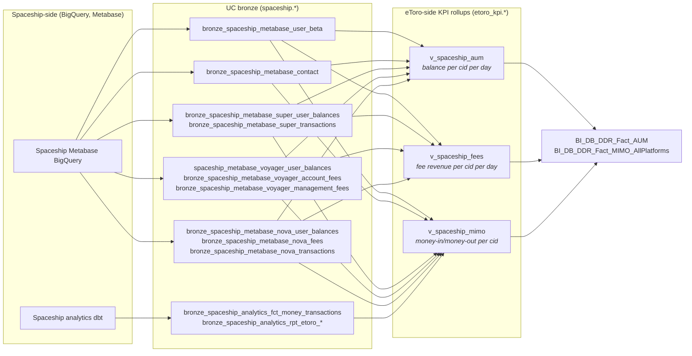

# Spaceship — UK SIPP / ISA / Voyager / Nova / Super

## What this domain is

Spaceship is an Australian micro-investing and superannuation platform that eToro acquired and now operates as the eToro UK pension/ISA stack. The Spaceship side runs its own production systems on **Metabase + BigQuery**; only **read-only daily ingests** land in our Unity Catalog under the `spaceship.*` schema. The eToro-side then builds three rollup views per metric — `v_spaceship_aum`, `v_spaceship_fees`, `v_spaceship_mimo` — that fan into the canonical DDR / KPI panels.

Spaceship has three product lines, each with its own bronze table family:

| Product | Bronze tables (UC) | What it is |
|---------|--------------------|------------|
| **Voyager** | `bronze_spaceship_metabase_voyager_*` | Goal-based investing accounts (the Spaceship original product) |
| **Nova** | `bronze_spaceship_metabase_nova_*` | Newer product, US-flavoured; nova_fees + nova_transactions are the fee inputs |
| **Super** | `bronze_spaceship_metabase_super_*` | UK SIPP / superannuation accounts; super_user_balances + super_transactions |
| **Cross-product** | `bronze_spaceship_metabase_user_beta`, `bronze_spaceship_metabase_contact`, `bronze_spaceship_metabase_voyager_account_fees`, etc. | Per-customer master data + identity bridge to eToro |

There is no source-SQL repository we can read — the only contract is **what shipped to UC**.

## Mental model

## Cluster provenance

Spaceship sits inside the **DDR/MIMO Cluster 13** (see `knowledge/skills/_brief_cluster_13.md`). Of the 5 cluster members tagged as `spaceship.*`, all are bronze tables fanning into the three `v_spaceship_*` views above. Anchor evidence:

- `bronze_spaceship_metabase_user_beta` — referenced by all 3 KPI views; identity bridge.
- `bronze_spaceship_metabase_contact` — referenced by AUM + MIMO; gives `gcid` (eToro customer id).
- `bronze_spaceship_metabase_super_user_balances`, `voyager_user_balances`, `nova_user_balances` — three product balance tables that union into `v_spaceship_aum`.
- `bronze_spaceship_metabase_super_transactions`, `voyager_account_fees`, `voyager_management_fees`, `nova_fees`, `nova_transactions` — fee/txn tables that feed `v_spaceship_fees`.

The eToro-side identity bridge goes through `bi_db.bronze_sub_accounts_accounts` to map the Spaceship `user_id` to eToro `gcid`/`cid`.

## Authoring policy

Object documentation under this folder follows the **UC-only Tier 1–4 policy** defined in `.cursor/rules/uc-domain-doc/05-generate-doc.mdc`:

| Tier | Anchor (UC-only domains) | DWH equivalent |
|------|--------------------------|----------------|
| 1 | Confluence page authored by domain owner / Spaceship-side PRD | SSDT comment + Tier-1 wiki |
| 2 | Tableau workbook captions, calc-fields, custom SQL touching the table | Phase 5/8 SP scan |
| 3 | Genie space instructions / sample SQL / inline join_specs that reference the object | Phase 7 view-dep scan |
| 4 | Inferred from UC sampled values, naming convention, cluster brief | Phase 6 business-logic guesswork |
| `[UNVERIFIED]` | Anything below Tier 4 (pure agent inference) — must be flagged | Same |

The DWH framework's `Tier 1 = SSDT comment` mapping does NOT apply here — we have no SSDT files for Spaceship objects.

## Phase status

| Phase | Status | Output |
|-------|--------|--------|
| P0 Domain card | done | this file |
| P1 UC discovery | done | `_discovery/uc_inventory.json` (60 objects across 4 schemas, 1,393 columns) |
| P2 Confluence discovery | done | `_discovery/confluence_index.json` (3 high-confidence pages, 6 CQL queries) |
| P3 Tableau discovery | done | `_discovery/tableau_index.json` (0 workbook hits across 60 objects — clean negative) |
| P4 Databricks-native discovery | done | `_discovery/databricks_assets.json` (0 Genie spaces, 2 ingest notebooks) |
| P5 Doc generation pilot | done | `schemas/etoro_kpi/Views/v_spaceship_fees.md` + `.alter.sql` (7/7 columns Tier-1) |
| P6 Cross-object enrichment + UC deploy | deferred | `_deploy-index.md` |

## Discovery baseline (2026-05-04)

| Phase | Headline finding |
|-------|------------------|
| P1 UC | **60 UC objects** (56 EXTERNAL Delta tables + 4 views) across 4 schemas. **1,393 columns**, of which only **20 (1.4 %)** have UC comments today — virtually all on `v_spaceship_fees` from recent manual enrichment. **3 of 60 objects** have any table comment. The framework's job is to lift this. |
| P2 Confluence | **3 high-confidence pages** retained from 14 title-match hits. Best Tier-1: `Spaceship Data transfer to eToro Datalake - Security requirements` (BDP space). Other anchors: `Spaceship (retirement funds in Australia)` (CS, business primer) and `SpaceShip Integration - LLD` (BG, runtime API contract). **Zero** pages text-match `v_spaceship_*` or `bronze_spaceship_*` — confirms the doc gap is pre-discovery. |
| P3 Tableau | **Zero downstream workbooks, custom-SQL queries, or calc fields** reference any of the 60 spaceship objects. Three objects are even REGISTERED in Tableau metadata (the 3 `bizops_output_spaceship_*` and `v_spaceship_aum`); the rest are unknown to Tableau. Spaceship is a UC-native, Genie/SQL-only domain today. |
| P4 Databricks-native | **Zero Genie spaces** include any spaceship UC table in `data_sources.tables[]` (out of 144 spaces total). Some spaces mention "spaceship" in text/instructions but reference the bridge tables (`bi_db.bronze_sub_accounts_accounts`) rather than `spaceship.*` directly. **Two ingest notebooks** in `DataPlatform/databricks/de/Spaceship/` (`Spaceship- Main.py` orchestrator + `Spaceship - process table.py`); both write via abfss path so don't reference UC tables by name. |
| P5 Doc gen | First pilot wiki for `etoro_kpi.v_spaceship_fees` (7 columns) generated end-to-end. **All 7 columns Tier-1** by sourcing the existing UC comment (rich, 9 KB) + 3 Confluence anchors. Validates that the framework can produce a fully-cited wiki when even one Tier-1 source is rich; for objects with sparse Tier-1, expect the policy to fall through to Tier-3 (Genie/notebooks) and Tier-4 (UC samples + cluster brief). Companion `.alter.sql` re-states the existing UC comments via `COMMENT ON COLUMN` for redeploy safety. |

The Tier policy in P5 must therefore expect **Tier-1 evidence to come from the BDP/CS/BG Confluence pages above + P0 cluster brief**, with Tier-2/Tier-3 evidence largely absent — driving us toward Tier-4 (UC sample data) for column-level descriptions.
