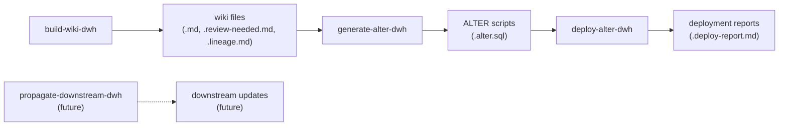

# Data Model: Pipeline Decomposition — Wiki Build + ALTER Generation + Deployment

**Branch**: `002-mass-process-orchestration` | **Date**: 2026-03-16

---

## Entity Relationship Diagram

`_index.md` tracks wiki build progress. `_deploy-index.md` tracks ALTER generation plus deployment progress (not a single combined “write-objects” step).



Text equivalent:

```
build-wiki-dwh  -->  wiki files (.md, .review-needed.md, .lineage.md)
generate-alter-dwh  -->  ALTER scripts (.alter.sql)
deploy-alter-dwh  -->  deployment reports (.deploy-report.md)
propagate-downstream-dwh  -->  downstream updates (future)
```

```
┌─────────────────────────────────────────────────────────────────────────────┐
│                         SCHEMA (DWH_dbo)                                    │
│                                                                             │
│  ┌──────────────┐    ┌──────────────────────┐    ┌──────────────────┐      │
│  │  _index.md   │    │ _deploy-index.md     │    │ _batch_context   │      │
│  │  (wiki build │    │ (ALTER generation +    │    │    .json         │      │
│  │   tracking)  │    │  deployment tracking) │    │ (cross-batch     │      │
│  └──────┬───────┘    └──────────┬───────────┘    │  knowledge)      │      │
│         │                       │ reads from      └──────────────────┘      │
│         │ "Done" objects        │ _index.md (eligibility)                  │
│         │                       │                                          │
│         ▼                       ▼                                          │
│  ┌────────────────────────────────────────────────────────────────────┐     │
│  │                    OBJECT (per table/view/function)                 │     │
│  │                                                                     │     │
│  │  build-wiki-dwh ──► {Object}.md, .review-needed.md, .lineage.md    │     │
│  │                                                                     │     │
│  │  generate-alter-dwh ──► reads wiki ──► {Object}.alter.sql          │     │
│  │                         updates _deploy-index.md (Generated)      │     │
│  │                                                                     │     │
│  │  deploy-alter-dwh ──► runs .alter.sql ──► {Object}.deploy-report.md │     │
│  │                       updates _deploy-index.md (Deployed)           │     │
│  │                                                                     │     │
│  │  propagate-downstream-dwh (future) ──► downstream UC updates       │     │
│  └────────────────────────────────────────────────────────────────────┘     │
└─────────────────────────────────────────────────────────────────────────────┘
```

---

## Entities

### Entities

SSDT object types: Table, View, Stored Procedure, and other entities already in the pipeline are unchanged; **Function** is defined below.

#### Function

Represents a SQL Server user-defined function in the SSDT repository.

| Attribute | Type | Description |
|-----------|------|-------------|
| Schema | string | The schema name (e.g., `BI_DB_dbo`) |
| FunctionName | string | The function name (e.g., `Function_Revenue_TicketFee`) |
| ObjectType | enum | Always `Functions` |
| UCTarget | string | Unity Catalog target. Defaults to `_Not_Migrated` since most DWH functions don't have UC counterparts |
| PhasePath | string | Tailored phase path: no Phase 2/3 (no live sampling), reversed Phase 7 (find callers instead of dependencies) |
| WikiFile | string | Path to `knowledge/synapse/Wiki/{Schema}/Functions/{FunctionName}.md` |
| LineageFile | string | Path to `.lineage.md` companion |

---

## Entity: Wiki Build Command (`build-wiki-dwh`)

### Inputs

| Input | Source | Required |
|-------|--------|----------|
| Schema name | User argument | Yes |
| `_dependency_order.json` | Pre-computed | Yes |
| Synapse MCP connection | MCP server | Advisory (Phases 2-3 live data only per Constitution IX) |
| Atlassian MCP connection | MCP server | Yes |
| Upstream wiki files | Local repo | Advisory |
| Dataplatform repo (SP code) | Local repo | Advisory |
| `knowledge/glossary.md` | Local file | Advisory |
| `_batch_context.json` | Previous batch | On resume |
| `_index.md` | Previous run | On resume |

### Outputs (per object)

| Output | Format | Content |
|--------|--------|---------|
| `{Object}.md` | Markdown | Wiki documentation (8 sections) |
| `{Object}.review-needed.md` | Markdown | Review sidecar with Tier 4 items |
| `{Object}.lineage.md` | Markdown | Column-level production lineage |

### Outputs (per schema, per batch)

| Output | Format | Content |
|--------|--------|---------|
| `_index.md` | YAML + Markdown | Wiki build progress tracking |
| `_batch_context.json` | JSON | Cross-batch glossary/relationships |

### Scope Options

| Scope | Description |
|-------|-------------|
| Schema | Full batch processing for all objects in a schema |
| Status | Read-only progress display |
| Single | Document one object |

**Resume:** Auto-detected — if `_index.md` has `Queued` objects from an interrupted batch, the system resumes from the first Queued object. No explicit resume scope is needed.

---

## Entity: `generate-alter-dwh` Command

Generates ALTER scripts from existing wiki files. File generation only — does not execute against Databricks.

| Attribute | Type | Description |
|-----------|------|-------------|
| Scope | enum | `schema`, `single`, `status`, `regenerate` |
| Schema | string | Target schema name |
| InputSource | string | Wiki `.md` files from `build-wiki-dwh` |
| OutputFile | string | `.alter.sql` per object |
| Tracking | string | Updates `_deploy-index.md` with `Generated` status |
| BatchSize | integer | Default 25 |
| UCResolution | string | Optional Databricks MCP query to resolve `_Pending` UC targets |

---

## Entity: `deploy-alter-dwh` Command

Executes ALTER scripts against Unity Catalog. Requires Databricks MCP.

| Attribute | Type | Description |
|-----------|------|-------------|
| Scope | enum | `schema`, `single`, `resume`, `status`, `dry-run` |
| Schema | string | Target schema name |
| InputSource | string | `.alter.sql` files from `generate-alter-dwh` |
| OutputFile | string | `.deploy-report.md` per object |
| Tracking | string | Updates `_deploy-index.md` with `Deployed` status |
| ExecutionStrategy | string | Single `databricks.sql.connect()` session per batch, sequential statements |

---

## Entity: `propagate-downstream-dwh` Command (Future)

Propagates column descriptions to downstream tables that inherit from documented objects.

| Attribute | Type | Description |
|-----------|------|-------------|
| Scope | enum | `discover`, `execute`, `status` |
| Schema | string | Target schema name |
| Strategy | string | Bottom-up execution order; documented objects never overwritten |
| Status | string | Not yet implemented — placeholder |

---

## Entity: `_index.md` (Wiki Build Tracking)

### YAML Frontmatter

```yaml
---
schema: DWH_dbo
database: Synapse DWH
total_objects: 281
documented: 120
failed: 2
last_batch: 8
last_updated: "2026-03-18"
quality_avg: 7.8
---
```

### Status Values

| Status | Meaning |
|--------|---------|
| `Done (Batch N)` | Wiki + sidecar written in batch N |
| `Queued (Batch N, #M)` | Assigned to batch N, position M |
| `Pending` | Not yet assigned to any batch |
| `Failed (Batch N) — {reason}` | Failed during batch N |
| `Skipped — stale <30d` | Wiki file exists and is fresh |

Same format as existing `_index.md` — no structural changes needed. Only `DEFAULT_BATCH_SIZE` increases to 15.

---

## Entity: `_deploy-index.md` (Deployment Tracking)

### YAML Frontmatter

```yaml
---
schema: DWH_dbo
database: Synapse DWH
total_deployable: 120
deployed: 80
failed: 3
last_batch: 4
last_updated: "2026-03-20"
---
```

### Status Values

| Status | Meaning |
|--------|---------|
| `Generated (Batch N)` | `.alter.sql` written in batch N; not yet executed in UC |
| `Deployed (Batch N)` | ALTER executed successfully in batch N |
| `Queued (Batch N, #M)` | Assigned for deployment |
| `Pending` | Has wiki doc but not yet scheduled |
| `Failed (Batch N) — {reason}` | ALTER execution failed |
| `Stale — wiki updated` | Wiki was regenerated after last deploy |

### Markdown Body

```markdown
## Deployment Progress

| Metric | Value |
|--------|-------|
| **Deployable** | {count with Done status in _index.md} |
| **Deployed** | {count} ({pct}%) |
| **Failed** | {count} |
| **Stale** | {count} |

## Next Deployment Batch (Batch N) — {M} objects

| # | Object | Type | Wiki Quality | Dependencies |
|---|--------|------|-------------|--------------|
| 1 | DWH_dbo.Dim_ActionType | Table | 7.8 | (none) |
| ... | ... | ... | ... | ... |

## Completed Deployments (newest first)
...

## Tables
| Object | Wiki Quality | Deploy Status | Last Deployed |
|--------|-------------|---------------|---------------|
| ... | ... | ... | ... |

## Views
...
```

---

## Entity: Phase 11 Slim (Wiki Build Variant)

### What Changes From Current Phase 11

| Section | Current | Wiki Build Variant |
|---------|---------|-------------------|
| Wiki `.md` generation | ✅ | ✅ Same |
| Review sidecar generation | ✅ | ✅ Same |
| UC Object Resolution | ✅ (3-4 UC queries) | ❌ Removed |
| UC Table Metadata Discovery | ✅ (2 UC queries) | ❌ Removed |
| ALTER script generation | ✅ | ❌ Moved to `generate-alter-dwh` |
| Table tags | ✅ | ❌ Moved to `generate-alter-dwh` |
| PII tags | ✅ | ❌ Moved to `generate-alter-dwh` |
| Downstream propagation | ✅ | ❌ Future: `propagate-downstream-dwh` |
| Deploy script + execution | ✅ | ❌ Moved to `deploy-alter-dwh` |
| Deploy report | ✅ | ❌ Moved to `deploy-alter-dwh` |
| Quality score calculation | ✅ | ✅ Same |
| Cross-object pre-read | ✅ | ✅ Same |

### Wiki Template Changes

The wiki properties table uses placeholder values for UC-specific fields:

```markdown
| **UC Target** | _Pending — resolved during generate-alter-dwh_ |
| **UC Format** | _Pending_ |
| **UC Partitioned By** | _Pending_ |
| **UC Table Type** | _Pending_ |
```

Phase 11 Rules B1-B7 (batch quality enforcement) are preserved — they apply to wiki generation regardless of whether ALTER scripts follow.

---

## Entity: Phase 11W — Generate ALTER + Deploy Logic (`11w-write-objects.mdc`)

### New Rule File: `11w-write-objects.mdc`

Encapsulates UC-facing operations previously embedded in Phase 11, split across **`generate-alter-dwh`** (steps 1–7, file output) and **`deploy-alter-dwh`** (execution + deploy report). Downstream propagation moves to **`propagate-downstream-dwh`** when implemented.

1. **Wiki Parsing**: Read existing `.md` file, extract Elements table, Business Meaning, Lineage
2. **UC Object Resolution**: Same algorithm as current Phase 11 (search information_schema, SHOW TABLES, mapping view)
3. **UC Table Metadata**: DESCRIBE DETAIL + DESCRIBE TABLE EXTENDED for format/partitioning
4. **Generic Pipeline Mapping**: Query for refresh_frequency, sla, source_system
5. **PII Detection**: GDPR tables + column patterns
6. **ALTER Generation**: Same template as current Phase 11 (`generate-alter-dwh`)
7. **Tag Generation**: Same tag set (`generate-alter-dwh`)
8. **Downstream Propagation**: Same deep lineage library (future: `propagate-downstream-dwh`)
9. **Execution**: Single `databricks.sql.connect()` session per batch, sequential statements (`deploy-alter-dwh`)
10. **Deploy Report**: Same template (`deploy-alter-dwh`)

### Wiki Backfill (Optional)

After UC resolution, optionally update the wiki `.md` file's properties table with the resolved UC target and metadata. This is a quality-of-life improvement, not a requirement.

---

## Relationships Between Entities

```
build-wiki-dwh
┌────────────────┐
│  _index.md     │  wiki build progress
│  {Object}.md   │  .review-needed.md  .lineage.md
│  _batch_       │  (only build-wiki-dwh reads/writes _batch_context.json)
│   context.json │
└───────┬────────┘
        │ wiki files
        ▼
generate-alter-dwh
┌────────────────┐
│ _deploy-       │  "Done" in _index.md → eligible for Generated
│  index.md      │  updates: Generated, Queued, etc.
│  .alter.sql    │
└───────┬────────┘
        │ .alter.sql
        ▼
deploy-alter-dwh
┌────────────────┐
│ _deploy-       │  updates: Deployed, Failed, etc.
│  index.md      │
│ .deploy-report │
│    .md         │
└────────────────┘

propagate-downstream-dwh (future) ──► downstream UC updates
```

### Deploy reporting (operator visibility)

Agents implementing `generate-alter-dwh` and `deploy-alter-dwh` MUST follow **`deploy-index-management.mdc` Protocol 6**: each run ends with an explicit summary (schema, `_deploy-index.md` path + created/updated/missing, counts, next step). This is separate from the index file contents but is required so operators are never left inferring state from silent success.

**BI_DB functions**: Synapse TVFs/scalars with `_Not_Migrated` get **stub** `.alter.sql` (comments only) + repo **`.lineage.md`**; they appear in `_deploy-index.md` as **`Stub only — not in UC`** (not `Deployed`).

### Dependency Rules

1. An object must have status `Done` in `_index.md` before `generate-alter-dwh` can emit `.alter.sql` for it (and before `deploy-alter-dwh` can execute)
2. The wiki `.md` file must exist and pass validation (all 8 sections, Elements table) before ALTER generation
3. `_deploy-index.md` is created on first `generate-alter-dwh` or `deploy-alter-dwh` run — it may exist with `Generated` rows before any UC execution
4. `_batch_context.json` is only used within `build-wiki-dwh` — `generate-alter-dwh` and `deploy-alter-dwh` do not read it
5. Future downstream propagation (`propagate-downstream-dwh`) will require prior upstream objects to be deployed first (bottom-up order from `_dependency_order.json`); documented objects are never overwritten
