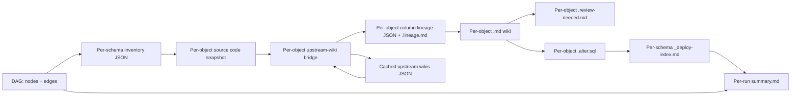

# Phase 1 Data Model: UC-Pipeline DAG-First Productization

**Feature**: [spec.md](./spec.md)
**Plan**: [plan.md](./plan.md)

This document defines the canonical schema for every persisted artifact this spec introduces or modifies. JSON shapes have a parallel JSON Schema under [contracts/](./contracts/). Markdown shapes have a structural contract there too.

## Entity: DAG node

**Purpose**: One row per UC object touched by the column-lineage query (Q1 in [research.md](./research.md#r-1-one-shot-dag-schema)). Every in-scope schema's objects + their transitive upstreams + their transitive downstreams within the same query window.

**Persistence**: array element of `nodes[]` in `knowledge/UC_generated/_dag.json`.

| Field | Type | Required | Description |
|---|---|---|---|
| `full_name` | string | yes | UC fully qualified name `catalog.schema.table`. Primary key. |
| `catalog` | string | yes | Always `main` for the pilot. Recorded so future multi-catalog rollouts don't break. |
| `schema` | string | yes | UC schema name (`de_output`, `bi_output`, etc., or upstream schemas like `dwh`, `bronze_db_schema`). |
| `table_type` | enum | yes | `MANAGED`, `EXTERNAL`, `VIEW`, `MATERIALIZED_VIEW`, `STREAMING_TABLE`. From `system.information_schema.tables.table_type`. |
| `wiki_status` | enum | yes | One of `documented_in_pack`, `documented_external`, `in_scope_not_yet_authored`, `terminal_no_wiki`, `out_of_scope`. See state-transition diagram below. |
| `routing_rule` | enum, nullable | yes | Which Phase 3 rule located the wiki (1, 2, 3, 4, 5, or `null` if `wiki_status ∈ {terminal_no_wiki, in_scope_not_yet_authored, out_of_scope}`). |
| `cached_wiki_path` | string, nullable | yes | Repo-relative path to the cached upstream wiki body (or `null`). |
| `in_pilot_scope` | bool | yes | `true` IFF `schema` is one of the 5 pilot schemas. Drives "is this object a documentation target?" |
| `topological_layer` | int | yes | 0 for terminal roots; otherwise `max(upstream.topological_layer) + 1`. Used for stable bottom-up iteration. |
| `source_code_available` | bool | yes | `true` IFF Phase 2 (`fetch_writer_source.py`) successfully cached source. `false` for opaque writers (e.g., `JOB` with no notebook task) — propagates to `.review-needed.md`. |
| `column_count` | int | yes | From `system.information_schema.columns` joined at DAG-build time (no extra query — same join). |

**State transitions**:

```mermaid
stateDiagram-v2
    [*] --> in_scope_not_yet_authored : DAG built; in_pilot_scope=true; ≥1 upstream is documented_*
    [*] --> documented_external : Phase 3 Rule 1/3/4/5 hit
    [*] --> documented_in_pack : prior run authored .md
    [*] --> terminal_no_wiki : no upstream rows in Q1
    [*] --> out_of_scope : in_pilot_scope=true; zero documented_* upstreams transitively
    in_scope_not_yet_authored --> documented_in_pack : run authored .md
    in_scope_not_yet_authored --> failed : phase 0-6 hard error
    failed --> in_scope_not_yet_authored : --force re-run
```



**Validation rules**:

- `routing_rule ∈ {1, 2, 3, 4, 5}` IFF `wiki_status ∈ {documented_external, documented_in_pack}`.
- `cached_wiki_path` IS NOT NULL IFF `wiki_status ∈ {documented_external, documented_in_pack}`.
- `topological_layer >= 0`. Layer 0 nodes have empty `upstreams`.
- For any node with `wiki_status = in_scope_not_yet_authored`, at run start every upstream has `wiki_status ∈ {documented_external, documented_in_pack, in_scope_not_yet_authored, terminal_no_wiki}` — NOT `out_of_scope`. (If any upstream is `out_of_scope`, the node itself becomes `out_of_scope`.)

## Entity: DAG edge

**Purpose**: One row per `(upstream_node, downstream_node, upstream_column, downstream_column)` quadruple from Q1 ([research.md R-1](./research.md#r-1-one-shot-dag-schema)).

**Persistence**: array element of `edges[]` in `knowledge/UC_generated/_dag.json`.

| Field | Type | Required | Description |
|---|---|---|---|
| `from_node` | string | yes | Upstream `full_name`. Foreign key to `nodes[].full_name`. |
| `to_node` | string | yes | Downstream `full_name`. Foreign key. |
| `from_column` | string | yes | Upstream column name. |
| `to_column` | string | yes | Downstream column name. |
| `event_count_90d` | int | yes | Number of column-lineage events observed in the last 90 days. Stability signal. |
| `is_passthrough_only` | bool | yes | Heuristic: `true` IFF Phase 2 source-code analysis shows this `to_column` is a direct reference (no CASE, no arithmetic, no aggregate). Computed during Phase 4, populated retroactively on subsequent runs. |

**Validation rules**:

- The graph induced by edges MUST be acyclic. Cycle → hard fail at DAG-build with the cycle named.
- `from_node` and `to_node` MUST resolve to entries in `nodes[]`.
- `event_count_90d >= 1`.

## Entity: Per-run audit summary

**Purpose**: One Markdown file per `python run_pipeline.py` invocation. Operator's single source of truth for "did this run work?"

**Persistence**: `knowledge/UC_generated/_runs/{ISO8601_timestamp}/summary.md`. The ISO8601 timestamp uses UTC with second precision, `:` replaced by `-` for filesystem-safety: e.g. `2026-05-17T19-00-00Z`.

**Required sections** (in this order):

1. Header (`# Run Summary — {timestamp}`).
2. Frontmatter-style key-value block (`**Schemas**`, `**Wall-clock**`, `**UC queries**`, `**Phases run**`, `**Force**`).
3. Per-schema rollup table — columns: `Schema`, `In-scope`, `Out-of-scope`, `Generated`, `Deployed`, `Blocked`, `Failed`. Last row is `**TOTAL**`.
4. Blocked-objects table grouped by upstream FQN. Columns: `Upstream FQN`, `Blocking N objects`, `Routing-rule attempts` (one-line summary of which rules missed).
5. Phase time breakdown table — columns: `Phase`, `Wall-clock`, `Rows` (free-text per-phase description).
6. Errors section — bullet list (or `(none)` line).

**Validation rules**:

- `TOTAL` row of per-schema rollup MUST equal column-wise sum.
- Total `In-scope + Out-of-scope` MUST equal `nodes[]` count of `in_pilot_scope=true`.
- Every Blocked row MUST appear in at least one schema's `_deploy-index.md` as a `Blocked` status.

## Entity: Deploy-index row

**Purpose**: Already-defined entity from the existing `uc-pipeline-doc` pack. Re-stated here for completeness; this spec does NOT change the shape — only confirms the `Blocked` status class.

**Persistence**: row in `knowledge/UC_generated/{schema}/_deploy-index.md`.

| Field | Type | Required | Description |
|---|---|---|---|
| Object FQN | string | yes | UC fully qualified name. |
| Status | enum | yes | `Pending`, `Generated`, `Deployed (Batch N)`, `Failed (deploy Batch N)`, `Blocked (upstream wiki missing: <fqn>)`, `Stub only`. |
| Last action | ISO date | yes | YYYY-MM-DD. |
| Notes | free text | no | Cause for `Failed` / `Blocked`. |

**Validation rules** (already enforced by existing `tools/deploy_alter_batch.py`):

- Header row identical across all per-schema indexes.
- Rollup line at top names per-status counts; must match row count.

## Entity: Cached upstream wiki entry

**Purpose**: One JSON object per upstream UC object whose wiki was located via Phase 3 Rules 1-5. Read once at run start, never re-fetched per object.

**Persistence**: `knowledge/UC_generated/_index_cache/upstream_wikis.json`.

```json
{
  "main.dwh.gold_sql_dp_prod_we_dwh_dbo_fact_customeraction": {
    "routing_rule": 1,
    "wiki_path": "knowledge/DWH_dbo/Tables/Fact_CustomerAction.md",
    "fetched_at": "2026-05-17T19:01:12Z",
    "columns": {
      "GCID": {
        "description": "Global Customer ID (Tier 1 — origin History.Credit).",
        "tier_tag": "Tier 1 — origin"
      },
      "...": "..."
    }
  }
}
```

**Validation rules**:

- Every key MUST be a valid UC FQN.
- `routing_rule ∈ {1, 2, 3, 4, 5}`.
- `wiki_path` MUST exist on disk at run start (validated by build_dag.py).
- `columns` MUST have ≥1 entry — empty columns map means the wiki didn't parse correctly; treat as cache miss.

## Entity: Per-object artifact set

**Purpose**: Unchanged from the existing pack. Re-stated to anchor the FR-009 + Assertion 13 references.

**Persistence**: under `knowledge/UC_generated/{schema}/{Tables|Views}/{object_short_name}.*`:

| File | Producer phase | Constitutional anchor |
|---|---|---|
| `.md` | 5 | Principle I (agent-readable), II (tier hierarchy), III (no fabrication), V (canonical schema), XI (no unsubstantiated facts) |
| `.lineage.md` | 4 | Principle VI (lineage first-class) |
| `.review-needed.md` | 5 | Principle III (review sidecar mandatory) |
| `.alter.sql` | 6 | Principle I (ultimate deliverable, 1024-char limit) |

All four files MUST exist before the object is marked `Generated` in the deploy index.

## Entity-relationship overview



Every solid arrow is a "must exist before next phase runs" hard prerequisite. `--force` rebuilds the producer; downstream phases re-read fresh inputs.

## Entity: Per-object adversarial evaluation record

**Purpose**: One record per object that passed through Phase 7 (adversarial evaluation). Captures the rubric scores, hard-gate verdicts, and (if FAIL) the regeneration feedback so a follow-up run can act on it.

**Persistence**: appended to `knowledge/UC_generated/{schema}/_discovery/evaluations/{object}.json`. Survives re-runs; the latest record's `verdict` populates the deploy-index status.

```json
{
  "object_fqn": "main.de_output.de_output_etoro_kpi_fact_customeraction_w_metrics",
  "evaluator_attempt": 1,
  "scores": {
    "inheritance_fidelity": 9.5,
    "source_code_narration_accuracy": 8.0,
    "null_with_provenance_correctness": 10.0,
    "completeness": 9.0,
    "shape_fidelity": 10.0,
    "lineage_coherence": 9.5
  },
  "weighted_score": 9.2,
  "hard_gates": {
    "inheritance_fidelity_table_present": true,
    "no_unanchored_inferred_descriptions": true
  },
  "verdict": "PASS",
  "regeneration_feedback": null,
  "evaluated_at": "2026-05-17T19:34:11Z",
  "model_used": "claude-opus-4.7"
}
```

| Field | Type | Required | Description |
|---|---|---|---|
| `object_fqn` | string | yes | UC fully qualified name. |
| `evaluator_attempt` | int | yes | `1` for first-pass eval; `2` for post-regen eval. Capped at 2. |
| `scores.*` | float | yes | Per-dimension score 1-10. All 6 dimensions required. |
| `weighted_score` | float | yes | Sum of `dim_score * dim_weight`; ranges 1-10. |
| `hard_gates.*` | bool | yes | Per-gate pass/fail; both must be `true` for verdict PASS. |
| `verdict` | enum | yes | `PASS` or `FAIL`. PASS requires `weighted_score >= 7.5` AND all `hard_gates` pass. |
| `regeneration_feedback` | string, nullable | yes | Concrete, actionable feedback for Phase 5 regenerator if `verdict = FAIL`. Otherwise `null`. |
| `evaluated_at` | ISO datetime | yes | UTC timestamp. |
| `model_used` | string | yes | LLM identifier. Lets future audits trace verdicts to the model that produced them. |

**Validation rules**:

- `weighted_score >= 7.5` AND both `hard_gates` true → `verdict = PASS`.
- Either condition false → `verdict = FAIL` AND `regeneration_feedback` must be non-empty.
- `evaluator_attempt = 1` → may have one follow-up record with `evaluator_attempt = 2`.
- `evaluator_attempt > 2` is forbidden (max 1 retry).
- Final-FAIL (attempt-2 verdict = FAIL) translates to deploy-index status `Failed (eval Batch -)`; the object's `.alter.sql` is NOT considered a deploy candidate even though the file exists.

**Audit aggregation**: the per-run audit summary (`_runs/{ts}/summary.md`) tallies:

- First-pass PASS count
- Regen-PASS count (attempt 1 FAIL → attempt 2 PASS)
- Final-FAIL count (attempt 2 FAIL)
- Average weighted score across all evaluated objects
- Dimension-level average scores (so systemic weaknesses surface — e.g. low Source-Code Narration Accuracy across the run signals a generator bug)

## Non-goals (data-model level)

- No relational normalization across runs — every run gets its own `_runs/{ts}/summary.md`.
- No global per-object history. The per-object `.md` file is the latest-state-only record; git history is the audit trail.
- No event/change feed. The pack is batch; downstream consumers poll the deploy index.
