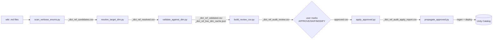

# Dictionary Reference Audit

Centralised audit pipeline that finds verbose dictionary enumerations in wiki
column descriptions (e.g. `Regulation - 1=CySEC, 2=FCA, 3=NFA, ...`), strips
them, and replaces with a clean `FK to Dim_X.` reference.

## Why

Verbose enumerations stuffed into a single description cell are:

- **Noise for retrieval-augmented agents.** A Genie vector search just needs to
  know there's a `Dim_X` to peek into.
- **Often stale or partial.** The wiki claim drifts from the live `Dim_X`.
- **Often delusional.** Hallucinated IDs (e.g. `InstrumentTypeID=73`) creep in
  through earlier propagation runs.

## Policy

| Where | Action |
|---|---|
| Inside `Dim_X.md` Elements table, on `Dim_X`'s own natural-key / label columns | **KEEP** the verbose enum (this is the source of truth and lives here on purpose). |
| Any other column anywhere (Fact, BI_DB, other Dim_Y, View, Function output) | **STRIP** the enum block, replace with `FK to Dim_X.` while preserving tier tag, source-of-record citation, and sentinel callouts. |
| Delusional / partial / mismatched enums | **Flag** in the review CSV. User decides per row. |

Self-references are dropped automatically by `resolve_target_dim.py`.

## Files in this folder

| Script | What it does | When to run |
|---|---|---|
| `scan_verbose_enums.py` | Regex sweep of every wiki `.md` Elements row. Threshold `>= 3` `N=Label` matches in one description = candidate. Writes `knowledge/_dict_ref_candidates.csv`. | Step 1 |
| `resolve_target_dim.py` | Maps each `column_name` to its target `Dim_X` (irregular map + `<X>ID -> Dim_<X>` heuristic + `Dictionary.X` fallback). Drops self-references. Writes `knowledge/_dict_ref_resolved.csv`. | Step 2 |
| `validate_against_dim.py` | Extracts canonical `{id: label}` from each `Dim_X.md` (via enum entries embedded in that wiki) and cross-checks every claim. Classifies `clean / partial / mismatched_labels / delusional / unverifiable / no_target`. Writes `knowledge/_dict_ref_validated.csv` + caches canonicals to `knowledge/_dict_ref_live_dim_cache.json`. | Step 3 |
| `build_review_csv.py` | Aggregates by `(column_name, target_dim)` so one decision covers all affected wikis. Builds suggested replacements. Writes `knowledge/_dict_ref_audit_review.csv` for the user to mark `APPROVE / SKIP / MODIFY`. | Step 4 |
| `apply_approved.py` | After user fills in `decision` column, surgically rewrites the description cell of each affected Elements row. DRY-RUN by default. Writes `knowledge/_dict_ref_audit_apply_report.csv`. | Step 5 |
| `propagate_approved.py` | From the apply report, regenerates affected `.alter.sql` via `tools/regen_alter_from_wiki.py`, then deploys to UC via `tools/redeploy_schema.py` (tables) and `tools/_tmp_deploy_view_comments.py` (views). DRY-RUN by default. | Step 6 |

## Pipeline



## Workflow

### 1. Scan + resolve + validate + build review CSV

```bash
python tools/dict_ref_audit/scan_verbose_enums.py
python tools/dict_ref_audit/resolve_target_dim.py
python tools/dict_ref_audit/validate_against_dim.py
python tools/dict_ref_audit/build_review_csv.py
```

All four steps are offline. No DB calls. Output:
`knowledge/_dict_ref_audit_review.csv`.

### 2. User review (gate)

Open `knowledge/_dict_ref_audit_review.csv`. Each row covers one
`(column_name, target_dim)` decision and lists how many wiki files it
affects. Columns to fill in:

- **`decision`** — one of `APPROVE`, `SKIP`, `MODIFY` (blank = SKIP).
- **`override_text`** — only for `MODIFY`: the description text to inject
  instead of `suggested_replacement`.
- **`notes`** — optional free-form for the human reviewer.

### 3. Dry-run the applier

```bash
python tools/dict_ref_audit/apply_approved.py
```

Reports what WOULD be edited. Inspect `_dict_ref_audit_apply_report.csv`.

### 4. Apply for real

```bash
python tools/dict_ref_audit/apply_approved.py --apply
```

This rewrites the description cell of every affected wiki Elements row.

### 5. Propagate to UC

```bash
python tools/dict_ref_audit/propagate_approved.py            # dry-run
python tools/dict_ref_audit/propagate_approved.py --apply    # deploy
```

`propagate_approved.py`:

1. Runs `tools/regen_alter_from_wiki.py` on every affected wiki to refresh
   the `.alter.sql`.
2. Calls `tools/redeploy_schema.py --files <paths> --label dict_ref_audit_<date>`
   for table targets.
3. Calls `tools/_tmp_deploy_view_comments.py` for view targets.

## Inputs and outputs

### Inputs (existing repo state)

- `knowledge/synapse/Wiki/**/*.md` — all DWH semantic wikis.
- `knowledge/synapse/Wiki/**/Dim_*.md` — used as the canonical source for
  `validate_against_dim.py`. The Dim wikis remain the single source of truth.

### Outputs (per run, all under `knowledge/`)

| File | Purpose |
|---|---|
| `_dict_ref_candidates.csv` | Raw scanner hits, one row per Elements row with `>= 3` enum entries. |
| `_dict_ref_resolved.csv` | Candidates annotated with `target_dim`, with self-references dropped. |
| `_dict_ref_validated.csv` | Candidates + validation status against canonical Dim_X. |
| `_dict_ref_live_dim_cache.json` | Canonical `{id: label}` per Dim_X (wiki-derived). Re-extracted each run. |
| `_dict_ref_audit_review.csv` | **User-facing.** Aggregated decisions. Mark APPROVE/SKIP/MODIFY. |
| `_dict_ref_audit_apply_report.csv` | Per-edit trace from `apply_approved.py`. |

## Hard rules

- **No file change before the review CSV is approved.** Both `apply_approved.py`
  and `propagate_approved.py` default to DRY-RUN. The user must pass `--apply`
  explicitly.
- **One decision row per `(column_name, target_dim)`.** Same column appearing
  in 30 tables produces ONE review row affecting 30 wikis.
- **Preserve in the rewritten description:** tier tag, source/passthrough/lineage
  notes, NULL/sentinel callouts (e.g. `0=NULL placeholder`, `-1=DWH sentinel`),
  and distribution stats (e.g. `99.8%=2`). Strip ONLY the verbose `N=Label,
  N=Label, ...` block itself.
- **Dim_X's own primary-key / label column is exempt** — that content stays
  verbose by design.
- **The wiki .md is the single source of truth.** Never edit `.alter.sql`
  directly — always regenerate via `regen_alter_from_wiki.py` after a wiki
  edit.

## Status as of pipeline construction (2026-05-14)

- **383** raw scanner hits before tightening.
- **363** after non-greedy label regex (drops trailing prose).
- **328** after self-reference + ambiguous-target drops.
- **180** unique decisions in the review CSV, covering **327** wiki edits if
  all approved.

Breakdown by validation status:

| Status | Decisions | Wiki lines |
|---|---|---|
| `delusional` | 45 | 83 |
| `mismatched_labels` | 33 | 89 |
| `partial` | 17 | 40 |
| `unverifiable` (Dictionary.X with no wiki) | 34 | 56 |
| `no_target` (boolean / numeric / ambiguous) | 42 | 49 |
| `clean` | 9 | 10 |

## Extending

- **Adding a new irregular column->dim mapping**: edit `IRREGULAR_DIM_MAP`
  in `resolve_target_dim.py`.
- **Live Synapse validation**: `validate_against_dim.py` currently extracts
  canonical from `Dim_X.md`. To swap in live Synapse pulls, replace
  `extract_canonical_from_md` with an MCP / pyodbc call against
  `Dictionary.<X>`. Keep the cache file shape:
  `{ "<dim_md_rel>": { "source": "synapse", "n_entries": N, "entries": {"0": "Label", ...} }}`.

## Out of scope

- Cat A2 long-tail fill-in (~377 cols) — deferred separately.
- Partition columns `etr_y / etr_ym / etr_ymd` — Databricks platform
  limitation, cannot have UC comments.
- `C_junk` backup/test/util tables — intentionally skipped.
